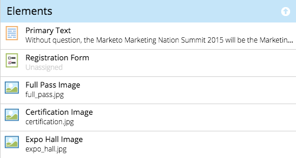

# Förstå element och variabler i guidade mallar {#understanding-elements-and-variables-in-guided-templates}

Mallar för guidade landningssidor har två typer av redigerbara sektioner: element och variabler.

## Element {#elements}

Elementen är de olika innehållsdelar som utgör en landningssida. Det kan vara bilder, text eller Marketo-resurser.

När du redigerar en guidad landningssida visas elementen om de har markerats som redigerbara i mallen. Elements kommer att ha följande ikoner:

*  bild
* Marketo-formulär
* Text
* Video
* Marketo-delningsknapp
* Marketo-avsökning
* Marketo-referens
* Lotteriet Marketo
* Marketo-kodfragment

## Variabel {#variables}

Variabler är tokenliknande attribut som kan anpassas från den guidade redigeraren på landningssidan, som visas nedan.

Det finns tre typer av variabler: strängvariabler, färgvariabler och booleska variabler.

<table>
 <tbody>
  <tr>
   <td>Sträng</td>
   <td>
Redigerbar text

Exempel: Titlar, datum, knappetiketter
</td>
  </tr>
  <tr>
   <td>Färg</td>
   <td>
Redigerbar hexkod för färg

Exempel: Bakgrundsfärg, teckensnittsfärg, kantfärg
</td>
  </tr>
  <tr>
   <td>Boolean</td>
   <td>
En spake som styr läge på/av för objekt eller format på landningssidan

Exempel: Visa sidfot (Ja/Nej), Antal kolumner (1/2), Bädda in Google Analytics (Sant/falskt)
</td>
  </tr>
 </tbody>
</table>

>[!MORELIKETHIS]
>
>[Skapa en mall för guidad landningssida](/help/marketo/product-docs/demand-generation/landing-pages/landing-page-templates/create-a-guided-landing-page-template.md)
