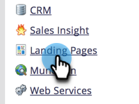

# Lägg till ytterligare CNAME för landningssida {#add-additional-landing-page-cnames}

Du kanske vill lägga till CNAME för landningssidor så att olika URL:er kan peka mot Marketo landningssidor. Om du följer stegen nedan kan du hantera flera domäner.

>[!CAUTION]
>
>Cookies kan inte delas mellan domäner.

>[!TIP]
>
>**Samma toppnivådomän - bra! Cookies delas**.  **go**.mincompany.com > **info**.mincompany.com
>
>**Olika toppnivådomäner - Felaktiga! Cookies är _not_ delad**.  gå.**mycompany**.com > go.**mynewcompany**.com

>[!NOTE]
>
>**Administratörsbehörigheter krävs**

1. Gå till **Administratör** område.

   

1. Klicka **Mitt konto**.

   

1. Bläddra ned till &quot;Support Information&quot; och kopiera ditt Munchkin-ID.

   

## Skicka begäran till IT {#send-request-to-it}

1. Be din IT-avdelning att installera följande CNAME: (Ersätt ordet [CNAME] med valfri CNAME och [Munchkin-ID] med texten från föregående steg).

   [CNAME].YourCompany.com > [Munchkin-ID].mktoweb.com

## Lägg till en ny CNAME {#add-a-new-cname}

1. När IT-avdelningen har skapat CNAME går du till **Administratör** område.

   

1. Klicka **Landningssidor**.

   

1. Klicka **Nytt** välj **Nytt domänalias**.

   

1. Ange **Domänalias.** The **Standardsida** visas om besökaren inte anger en URL. Ange vart de ska gå i så fall.

   >[!NOTE]
   >
   >För standardsidan kan du välja en landningssida eller en extern URL-adress, till exempel din offentliga webbplats.

   

1. Ange **Standardsida** och klicka **Skapa**.

   

Snyggt! Nu vet du vad du ska göra om du någonsin vill lägga till en CNAME.
