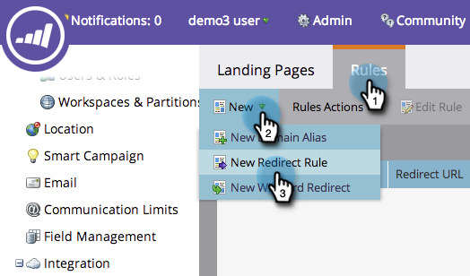

# Omdirigera en URL-sökväg {#redirect-a-url-path}

Marketo gör det enkelt att dirigera om en URL-sökväg till en sida som du väljer. Så här gör du.

>[!NOTE]
>
>**Administratörsbehörigheter krävs**

1. Under **Administratör**, klicka **Landningssidor**.

   

1. Klicka på **Regler** tabbtangenten och sedan klicka **Nytt** och **Ny omdirigeringsregel**.

   

1. Klicka på den första **Ursprunglig URL** och välja Marketo CNAME.

   

   >[!NOTE]
   >
   >Kom ihåg att du bara kan omdirigera URL:er som börjar med din Marketo [CNAME](/help/marketo/product-docs/demand-generation/landing-pages/landing-page-actions/customize-your-landing-page-urls-with-a-cname.md).

1. Ange URL-sökvägen (eller den specifika sidan) som du vill omdirigera i den andra **Ursprunglig URL** till höger.

   

1. Klicka **Använd icke-Marketo landningssida** skriver du den sida som du vill dirigera om besökare till i **Omdirigerings-URL** och klicka **Skapa**.

   

   Du kan [använda Marketo landningssidor](/help/marketo/product-docs/demand-generation/landing-pages/landing-page-actions/redirect-a-marketo-landing-page-to-another-page.md) som mål också.

Grattis! URL-sökvägen har omdirigerats.

>[!MORELIKETHIS]
>
>[Omdirigera en Marketo-landningssida till en annan sida](/help/marketo/product-docs/demand-generation/landing-pages/landing-page-actions/redirect-a-marketo-landing-page-to-another-page.md)
