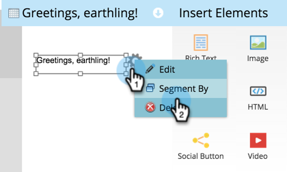

# Använd dynamiskt innehåll på en landningssida {#use-dynamic-content-in-a-landing-page}

>[!PREREQUISITES]
>
>* [Skapa en segmentering](../../../../product-docs/personalization/segmentation-and-snippets/segmentation/create-a-segmentation.md)
>* [Skapa en landningssida med valfri form](../../../../product-docs/demand-generation/landing-pages/free-form-landing-pages/create-a-free-form-landing-page.md)
>* [Lägga till ett nytt formulär på en startsida med valfri form](../../../../product-docs/demand-generation/landing-pages/free-form-landing-pages/add-a-new-form-to-a-free-form-landing-page.md)

>

Genom att använda dynamiskt innehåll på landningssidor engagerar du människor med riktad information.

## Lägg till segmentering {#add-segmentation}

1. Gå till **Marknadsföringsaktiviteter**.

   

   Klicka på landningssidan och sedan på Redigera utkast.

   

   Klicka på Segmentera efter.

   

   Ange namnet på segmenteringen och klicka på Spara.

   

   Segmenteringen och segmenten visas under Dynamic till höger.

   

   >[!NOTE]
   >
   >Alla landningssidelement är statiska som standard.

## Gör element dynamiskt {#make-element-dynamic}

1. Dra och släpp element från Static till **Dynamic**.

   

1. Du kan också göra elementen statiska eller dynamiska från elementet **Inställningar**.

   

## Använd dynamiskt innehåll {#apply-dynamic-content}

1. Markera ett element under ett segment och klicka sedan på **Redigera**. Upprepa för varje segment.

   

1. En grön bockmarkering anger innehåll som är specifikt för segment. Ett tomt värde anger standardsegmentinnehållet.

   

   >[!CAUTION]
   >
   >Ändringar i standardsegmentets innehållsblock tillämpas på alla segment.

   >[!TIP]
   >
   >Skapa en standardlandningssida innan du ändrar innehåll för de olika segmenten.

Voila! Nu kan du skicka riktat innehåll.

>[!NOTE]
>
>**Relaterade artiklar**
>
>* [Förhandsgranska en landningssida med dynamiskt innehåll](../../../../product-docs/demand-generation/landing-pages/landing-page-actions/preview-a-landing-page-with-dynamic-content.md)
>* [Använda dynamiskt innehåll i ett e-postmeddelande](../../../../product-docs/email-marketing/general/functions-in-the-editor/using-dynamic-content-in-an-email.md)

>

