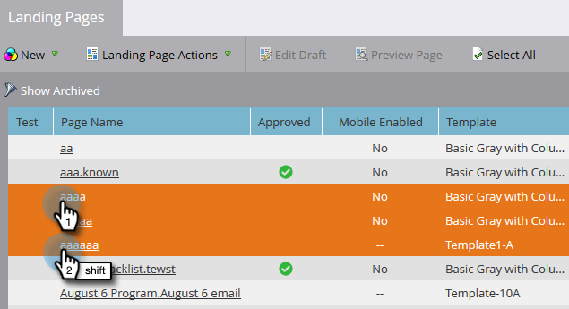

# Godkänn, Avgodkänn eller Ta bort en landningssida {#approve-unapprove-or-delete-a-landing-page}

Landningssidor är i utkastläge tills du godkänner dem. Godkännande gör sidor tillgängliga i resten av systemet. När du redigerar en godkänd landningssida sparar Marketo utkastet, men fortsätter att använda den godkända versionen tills du godkänner utkastet.

## Godkänn en landningssida {#approve-a-landing-page}

1. Välj en landningssida, gå till **Åtgärder för landningssida** och klicka **Godkänn**.

   >[!TIP]
   >
   >Du kan [godkänna flera sidor samtidigt](/help/marketo/product-docs/demand-generation/landing-pages/landing-page-actions/approve-multiple-landing-pages-at-once.md) för att göra livet enklare.

   

1. Du kan även högerklicka på landningssidan och klicka på **Godkänn**.

   

   >[!NOTE]
   >
   >När landningssidans ikon har godkänts är den grön.

## Avgodkänna en landningssida {#unapprove-a-landing-page}

1. Välj en landningssida, gå till **Åtgärder för landningssida** och klicka **Ogodkänd**.

   

1. Du kan även högerklicka på landningssidan och klicka **Ogodkänd**.

   

>[!NOTE]
>
>Den ej godkända landningssidan publiceras inte längre på webben och genererar ingen ytterligare aktivitet. Besökare på icke godkända landningssidor och deras Facebook-flikar ser [Reservsida](/help/marketo/product-docs/administration/settings/set-a-fallback-page.md).

## Ta bort en landningssida {#delete-a-landing-page}

1. Välj en landningssida, gå till **Åtgärder för landningssida** och klicka **Ta bort**.

   

   >[!NOTE]
   >
   >Du kan inte ta bort en godkänd landningssida. Ta bort godkännandet först.

1. Du kan även högerklicka på landningssidan och klicka på **Ta bort**.

   

## Ta bort flera landningssidor {#delete-multiple-landing-pages}

Vill du ta bort mer än en landningssida åt gången? Så här gör du.

1. In Design Studio, klicka **Landningssidor**.

   

1. Klicka på den första landningssidan som du vill ta bort och Skift-klicka sedan på den sista.

   

   >[!TIP]
   >
   >Du kan också använda Ctrl-klicka för att ta bort flera landningssidor som inte är sekventiella.

1. Klicka på **Åtgärder för landningssida** nedrullningsbar meny och välj **Ta bort**.

   

1. Klicka **Ta bort**.

   

Häftig! Nu vet du hur man godkänner, avgodkänner och tar bort landningssidor.
