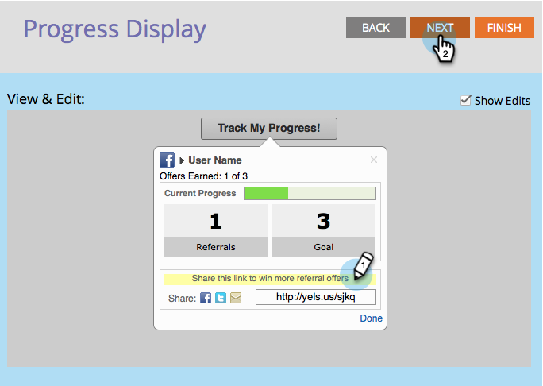

# Konfigurera förloppsflöde för spår för ett referenserbjudande {#configure-track-progress-flow-for-a-referral-offer}

När du [skapar ett hänvisningserbjudande](../../../../product-docs/demand-generation/social/referral-offers/create-a-referral-offer.md) kan du konfigurera de uppmaningar som visar deltagarnas framsteg mot belöningen.

1. Gå till **Marknadsföringsaktiviteter**.

   

1. Markera hänvisningserbjudandet och klicka på **Redigera utkast**.

   

1. Gå till **Spåra förloppsflöde** > **Sociala nätverk** i redigeraren för hänvisningserbjudanden.

   

1. I fönstret **Visa** **&amp;** **Redigera** redigerar du uppmaningen som påminner deltagarna att logga in på samma sociala nätverk som de använde för att registrera sig för ditt erbjudande.

   

   >[!NOTE]
   >
   >Markera den text du kan redigera genom att välja **Visa redigeringar** i det övre högra hörnet.

1. Redigera uppmaningen som uppmanar deltagaren att dela länken med fler vänner.

   

1. Redigera uppmaningen som informerar deltagaren om att han/hon har uppnått målet och bör kontrollera sin e-postadress.

   

1. Redigera meddelandet som informerar en framgångsrik deltagare om relevanta kampanjkoder för att lösa in deras belöning.

   

>[!MORELIKETHIS]
>
>Klicka sedan på **Slutför > Godkänn och stäng** och [publicera ditt hänvisningserbjudande](../../../../product-docs/demand-generation/social/referral-offers/publish-a-referral-offer.md).

