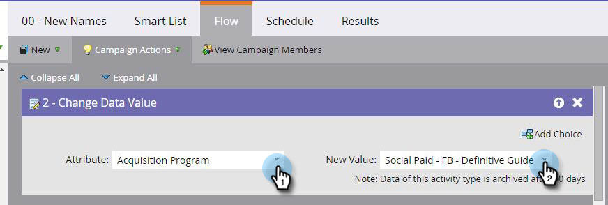

# Ställ in intäktsattribuering för digitala annonskampanjer {#set-up-revenue-attribution-for-digital-advertising-campaigns}

Så här skapar du intäktsattribuering för digitala annonskanaler och kampanjer. När ni har skapat det kan ni attribuera intäkter från första kontakten och multitouch för digitala annonser på samma sätt som i andra Marketo-program.

När du har konfigurerat ditt första annonseringsprogram i Marketo kan du klona och uppdatera det för andra kanaler. Du kan till exempel klona ett LinkedIn-program till ett Facebook-program.

Med separata program kan ni sedan spåra antalet konverteringar från var och en och se era program i Program Analyzer, Opportunity Influence Analyzer och andra funktioner i Marketo Analytics.

>[!PREREQUISITES]
>
>* Konfigurera en kanaltagg med statusvärden och programframgångar (t.ex. Digital Advertising eller Social Paid och PPC)
>* Skapa eller redigera ett formulär för att skicka en frågesträng via personen
>* Se till att ni har tillgång till vissa funktioner i IntäktsCycle Analytics för att rapportera om era annonskanaler och kampanjer

>

## Skapa ett standardprogram {#create-a-default-program}

Till skillnad från vissa program (till exempel e-post) som kan köras regelbundet under en viss tidsperiod, är standardprogram alltid aktiverade.

1. Gå till **marknadsföringsaktiviteter**.

   

1. Klicka på **Nytt** och välj **Nytt program**.

   

1. Om du redan har ett program kan du [klona det](../../../../product-docs/core-marketo-concepts/programs/working-with-programs/clone-a-program.md).

   >[!TIP]
   >
   >När du klonar ett program måste du se till att ersätta namnen i frågesträngsfälten i de smarta listorna.

1. Placera det nya programmet i en viss kampanjmapp när det första programmet har angetts.

   >[!NOTE]
   >
   >**Exempel**
   >
   >
   >En frågesträng som skickas via URL:en hjälper Marketo att veta vilken annonskampanj någon klickade på när de blev en person i Marketo.
   >
   >
   >Du kan skapa en frågesträngsmetod som innehåller alla variabler som du vill mäta. Marketo använder dessa variabler för att lägga till personer i olika program.
   >
   >
   >Du kan till exempel använda kanaltypen Kanal_Kanal_Resurs_Region. Det kan se ut så här: SP_FB_NewGuide_US. **Obs**: förkortningar sparar utrymme.
   >
   >
   >Du kan också ange det som Channel_Adsource_AssetName_Region_UniqueIdNumber. Det kan se ut så här: Social-Paid_Facebook_NewGuide_NA_123.

## Skapa en smart kampanj för nya namn {#create-a-smart-campaign-for-new-names}

1. I den smarta kampanjen skapar du en smart lista som innehåller två utlösare och två filter, som visas.

   

   >[!NOTE]
   >
   >Frågesträngen som används i de två utlösarna och filtret **Program som har hämtat namn** är unik för dig. Frågesträngarna som visas här är till exempel bara. Om du klonade fältet ersätter du dessa fält.

1. Skapa ett flödessteg om du vill ändra attributet till **förvärvsprogram** och ange det nya värdet till det värde du har definierat för betalda sociala kampanjer.

   

1. Schemalägg och aktivera kampanjen.

## Skapa en smart kampanj för status/lyckat program {#create-a-smart-campaign-for-status-program-success}

Ni behöver en andra smart kampanj för att ändra personernas status, så att de kan uppnå programframgångar och inkluderas i intäktsattribueringsberäkningarna.

1. Ange programnamnet i frågesträngen i utlösaren för **Fyll i formulär** . Om du klonar programmet ersätter du bara det gamla frågesträngnamnet med det nya.

   

1. Skapa flödessteg för att ändra status till en som är kopplad till programslutförande.

   

   >[!NOTE]
   >
   >I exemplet ovan visas **Converted, **men detta beror på din status/dina framgångsvärden.

1. Schemalägg och aktivera kampanjen.

## Skapa din annons {#create-your-ad}

Skapa den nya annonsen när du har konfigurerat programmet och kampanjerna.

1. Gå till kanalen, t.ex. LinkedIn eller Facebook.
1. Skapa en ny annons.
1. Välj en Marketo-landningssida som mål för Call To Action i kampanjen.
1. Lägg till frågesträngen i URL:en.

   >[!NOTE]
   >
   >**Exempel**
   >
   >
   >Så här kan du lägga till all information som du har angett i en faktisk URL-adress. Objekten avgränsas med ett et-tecken (&amp;):
   >
   >
   >[www.marketo.com?**source**=Social-Paid&amp;**comment**=Social-Paid_Facebook_NewGuide_NA&amp;**camp**=abc&amp;**kk=**xyz](http://www.marketo.com?source=Social-Paid&amp;comment=Social-Paid_Facebook_NewGUide_NA&amp;camp=abc&amp;kk+xyz)
   >
   >    
   >    
   >    * **källa** är den personkälla som används som kanalidentifierare
   >    * **kommentar** är den unika identifieraren som skapas för varje program
   >    * **lägret** är kampanjen på Facebook, LinkedIn eller Google
   >    * **kk** är det nyckelord eller resursnamn som du vill hämta

   >    
   >    
   >**De här fyra termerna måste vara gemena och det får inte finnas några blanksteg i URL:en för att informationen ska kunna hämtas.**

## Bästa praxis {#best-practices}

Använd en enda kanaltagg för att representera all digital annonsering, eller använd flera kanaltaggar om du vill ha mer detaljerade jämförelser med dina andra marknadsföringskanaler (till exempel Socialbetald, Sökbetald, Visning, Återmarknadsföring).

Skapa sedan olika program för varje rapportvy du behöver. Använd ett gemensamt ID som parameter i URL:en (till exempel BC) i frågesträngen om du har 10 regioner som startar en&quot;Big Campaign&quot; tillsammans och vill kunna visa resultat i olika regioner.

Om ni vill rapportera om varje region och de samlade resultaten av Big Campaign skapar ni 11 program - ett för varje region och ett för Big Campaign. Varje program refererar endast de relevanta tecknen från frågesträngen (till exempel BC).

Det finns avsiktlig överlappning mellan Big Campaign och regionsprogrammen, så du vill inte rapportera om det totala antalet människor i alla elva programmen, eftersom vissa finns både i Big Campaign och i ett av regionsprogrammen.
