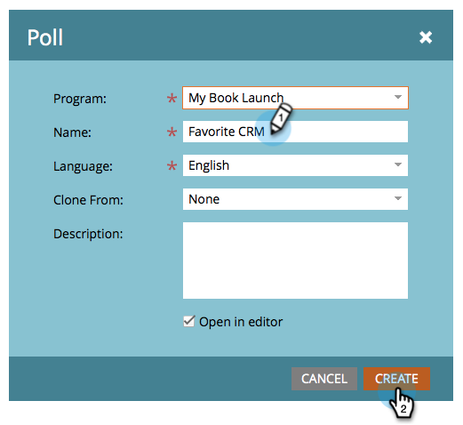
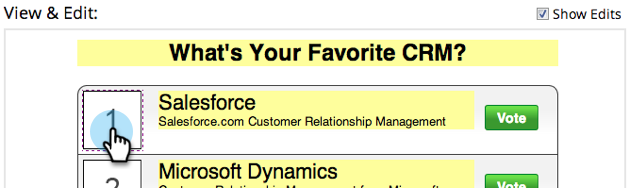

# Skapa en omröstning {#create-a-poll}

Engagera personer med en omröstning som de kan rösta i och dela med sina vänner i sociala nätverk. Du kan lägga till den på platser som dina landningssidor, din webbplats och Facebook.

>[!NOTE]
>
>**Tillgänglighet**
>
>Alla kunder har inte köpt den här funktionen. Kontakta din säljare för mer information.

>[!PREREQUISITES]
>
>Om du vill använda bilder i din omröstning lägger du till dem i Marketo Images- och Files-biblioteket innan du börjar. Lägg till en 60x60px-bild för varje omröstningspost. Se [Lägg till bilder och filer i Marketo](../../../../product-docs/demand-generation/images-and-files/add-images-and-files-to-marketo.md).

1. I programmet väljer du **Nytt** > **Ny lokal resurs.**

   

1. Klicka på **Avsökning i det** **lokala resursgalleriet.**

   

1. Namnge din omröstning.

   

   >[!TIP]
   >
   >Om du vill spara tid kan du använda alternativet **Klona från** för att kopiera alla inställningar från en befintlig videoresurs.

1. Skriv en rubrik för omröstningen (vanligtvis en kort fråga).

   

1. Redigera rubriken och beskrivningen för varje post.

   

1. Om du vill lägga till en post klickar du på **+** -symbolen och redigerar titeln och beskrivningen.

   

1. För varje post kan du lägga till en bild genom att klicka på den numrerade miniatyrbilden.

   

1. Markera den bild du behöver och klicka sedan på **Välj.**

   

1. När du har angett miniatyrbild, rubrik och beskrivning för alla poster klickar du på **Slutför.**

   

1. Klicka på **Godkänn** och **Stäng.**

   

Frågeredigeraren öppnas i ett nytt fönster. Standardinställningarna är bra, men du måste ändå lägga till dina omröstningsposter. Vi visar dig hur i nästa steg.

>[!TIP]
>
>Klicka på **Bakåt** om du vill ändra något av standardvärdena i din omröstning. Om du vill spara ditt arbete för senare bruk utan att godkänna klickar du på **Stäng**.

Om det finns några problem i omröstningen uppmanas du att åtgärda dem innan omröstningen godkänns. Grattis! Du har skapat din omröstning.

>[!NOTE]
>
>**Relaterade artiklar**
>
>Nästa steg är att [publicera omröstningen](publish-a-poll.md), men du kan ändra inställningarna för omröstningen om det behövs. Börja med att [anpassa omröstningsinställningarna](customize-poll-settings.md).

