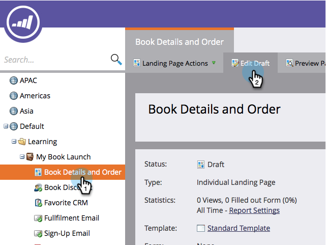

# Publicera en omröstning {#publish-a-poll}

När du har [skapat en omröstning](/help/marketo/product-docs/demand-generation/social/creating-a-poll/create-a-poll.md) kan du publicera den på din Markettill landningssidor, på Facebook och på din webbplats.

1. Navigera till landningssidan och öppna den för redigering.

   

1. Dra över **Rullande** från paletten till höger.

   

1. Välj din omröstning och klicka på **Infoga**.

   

>[!NOTE]
>
>Du måste godkänna din omröstning för att kunna göra den tillgänglig här.

Grattis! Godkänn landningssidan och din omröstning är live. Du kan även [publicera landningssidan på Facebook](/help/marketo/product-docs/demand-generation/facebook/publish-landing-pages-to-facebook.md) eller [lägga avsökningen på din webbplats](/help/marketo/product-docs/demand-generation/social/social-functions/deploy-social-on-your-website.md).

>[!TIP]
>
>Testa och förfina din omröstning. Gå till omröstningen på din webbsida och registrera dig med testinformation. Observera allt du vill ändra när det gäller användarens upplevelse.
