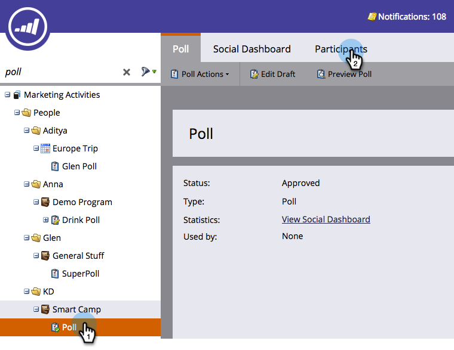

# Granska rösterna i omröstningen {#review-votes-cast-in-poll}

Vem röstade på vad i din omröstning? Låt oss ta reda på det.

1. I **marknadsföringsaktiviteter** väljer du omröstningen och klickar på fliken **Deltagare** .

   

1. Klicka på talet i kolumnen **Röster** .

   

1. Det de röstade om kommer att visas. Klicka på **Stäng**.

   

   >[!NOTE]
   >
   >**Relaterade artiklar**
   >
   >
   >Läs mer om apparnas sociala räckvidd och påverkan i [Visa sociala prestanda](../../../../product-docs/demand-generation/social/social-functions/view-social-performance.md).

