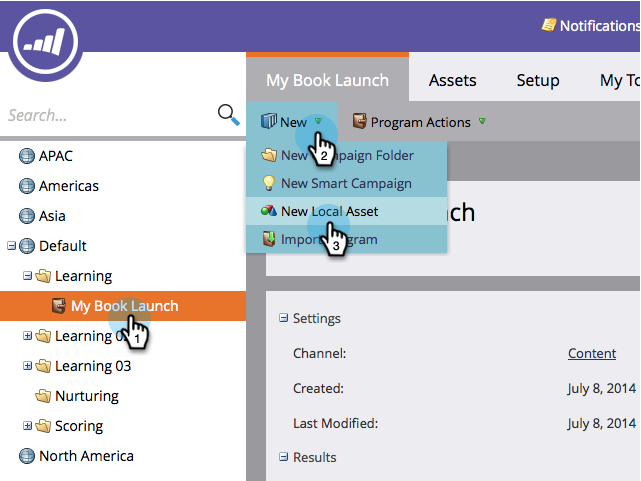

# Skapa ett hänvisningserbjudande {#create-a-referral-offer}

Med hänvisningserbjudanden får du en anledning att hänvisa sina vänner. Skapa mål och belöningar för lyckade hänvisningar. Du kan släppa det på landningssidor, på din webbplats och till och med på Facebook.

>[!NOTE]
>
>**Tillgänglighet**
>
>Alla kunder har inte köpt den här funktionen. Kontakta din säljare för mer information.

1. I programmet väljer du **Nytt** > **Ny lokal resurs.**

   

1. Klicka på **Hänvisningserbjudande i** det **lokala tillgångsgalleriet.**

   

1. Ange ert hänvisningserbjudande.

   

   >[!TIP]
   >
   >För att spara tid kan du använda alternativet **Klona från** för att kopiera alla inställningar från ett befintligt hänvisningserbjudande.

   Anvisningserbjudanderedigeraren öppnas i ett nytt fönster. Standardinställningarna är alla bra, men du måste lägga till en länk till reglerna för ditt erbjudande (villkor). Länken visas längst ned på delningsmeddelandeskärmar. Vi visar hur du gör i nästa steg.

1. Klicka på **Avancerade alternativ.**

   

1. Lägg till en länk till reglerna i ditt erbjudande. Ange **URL-adressen.**

   

   >[!NOTE]
   >
   >På den här skärmen kan du även lägga till en integritetspolicylänk. Se [Lägg till din integritetspolicy i en social app](../../../../product-docs/demand-generation/social/social-functions/add-your-privacy-policy-to-a-social-app.md).

1. Klicka på **Slutför.**

   

1. Klicka på **Godkänn** **och** **Stäng.**

   >[!TIP]
   >
   >Om du vill ändra standardinställningarna i ditt hänvisningserbjudande klickar du på **Bakåt**. Om du vill spara ditt arbete för senare bruk utan att godkänna klickar du på **Stäng.**

   

Om det uppstår några problem i hänvisningserbjudandet uppmanas du att åtgärda dem innan erbjudandet godkänns.

Grattis! Du har skapat ditt hänvisningserbjudande.

>[!NOTE]
>
>**Relaterade artiklar**
>
>Nästa steg är att [publicera ditt hänvisningserbjudande](publish-a-referral-offer.md) på en landningssida, på din webbplats eller på Facebook.

>[!NOTE]
>
>**Djupdykning**
>
>Alla standardinställningar, strängar och meddelanden kan ändras.

