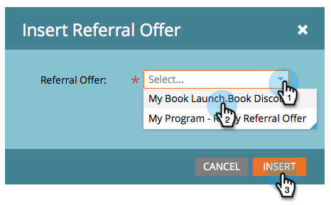

# Publicera ett hänvisningserbjudande {#publish-a-referral-offer}

När du har [skapat ett hänvisningserbjudande](create-a-referral-offer.md) kan du publicera det på din Markettill landningssidor, på Facebook och på din webbplats.

1. Navigera till landningssidan och öppna den för redigering.

   

1. Dra över **Referenserbjudande** från paletten till höger.

   

1. Välj ditt hänvisningserbjudande och klicka på **Infoga**.

   

>[!NOTE]
>
>**Påminnelse**
>
>Du måste godkänna ditt hänvisningserbjudande för att kunna göra det tillgängligt här.

Grattis! Godkänn landningssidan och ditt hänvisningserbjudande är öppet. Du kan även [publicera landningssidan på Facebook](../../../../product-docs/demand-generation/facebook/publish-landing-pages-to-facebook.md) eller [publicera erbjudandet på din webbplats](../../../../product-docs/demand-generation/social/social-functions/deploy-social-on-your-website.md).

>[!TIP]
>
>Testa och förfina ditt hänvisningserbjudande. Gå till erbjudandet på din webbsida och registrera dig med testinformation. Observera allt du vill ändra när det gäller användarens upplevelse.

