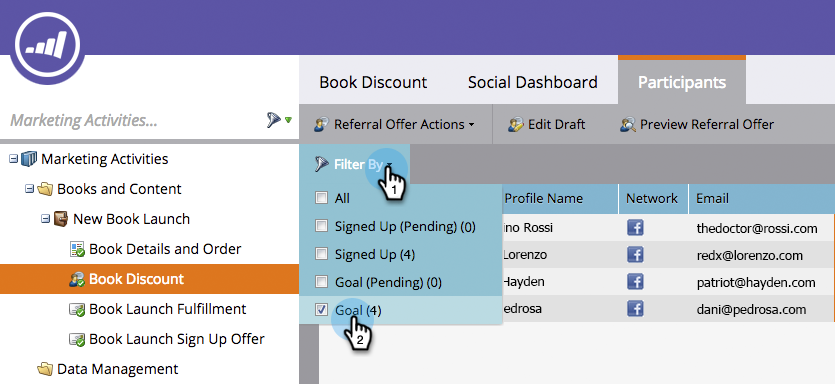

# Skicka e-post om uppfyllande av hänvisningserbjudande {#send-referral-offer-fulfillment-email}

Belöna era kunder med kuponger och rabattkoder med hjälp av e-postmeddelandet om att erbjudandet har genomförts.

>[!PREREQUISITES]
>
>* [Använd e-post i sociala kampanjer](/help/marketo/product-docs/demand-generation/social/social-functions/use-emails-in-social-promotions.md)
>* [Skapa ett hänvisningserbjudande](/help/marketo/product-docs/demand-generation/social/referral-offers/create-a-referral-offer.md)

## Ställ in leverans för uppfyllelse {#set-up-fulfillment-delivery}

1. Välj hänvisningserbjudandet. Klicka på **Redigera utkast**.

   

1. Under **Appinställningar** väljer du **Erbjudandeinformation**.

   

1. Välj ett **e-postmeddelande för registrering**.

   

1. Välj en **e-postadress för uppfyllelse**.

   

   >[!NOTE]
   >
   >Läs mer om [hur du använder e-post i sociala kampanjer](/help/marketo/product-docs/demand-generation/social/social-functions/use-emails-in-social-promotions.md).

1. Klicka på listrutan **Fulfillment Delivery** och välj **auto on target**.

   

   Meddelandet som valts i **E-post för uppfyllelse** skickas automatiskt till personer som uppfyller målet.

## Skicka manuellt {#manual-send}

Du kan skicka ett e-postmeddelande manuellt till en person när de har nått målet.

1. Markera hänvisningserbjudandet och klicka på fliken **Deltagare**.

   

1. Klicka på alternativet **Filtrera efter** och välj **Mål**.

   >[!NOTE]
   >
   >Detta väljer personer som har uppnått målet för hänvisningserbjudandet.

   

1. Markera personerna i den filtrerade vyn.

   

1. Högerklicka och välj **Skicka e-post för uppfyllelse**.

   

Häftig! Dessa personer får nu ett mejl om att de uppfyller villkoren och får en häpnadsväckande belöning.
