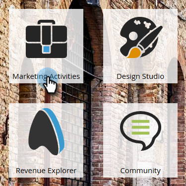

# Ange mål för hänvisningserbjudande {#specify-goal-for-referral-offer}

När du [skapar ett hänvisningserbjudande](/help/marketo/product-docs/demand-generation/social/referral-offers/create-a-referral-offer.md) måste du definiera leveransmålet. Målet kan definieras av personaktivitet på webbsidan, till exempel sidbesök eller registreringar. Du kan till och med använda en [anpassad JavaScript-händelse](/help/marketo/product-docs/demand-generation/social/social-functions/conversion-script-for-custom-events.md).

Du kan också använda en smart listutlösare i Marketför att vänta på en milstolpe, till exempel att en möjlighet skapas för den refererade personen.

Exempelmål:

* 10 refererade besök
* 5 refererade registreringar
* 1 refererad affärsmöjlighet skapad
* 2 refererade e-handelsköp
* 5 refererade webbinarium-deltagare

1. Gå till **Marknadsföringsaktiviteter**.

   

1. Markera hänvisningserbjudandet och klicka på **Redigera utkast**.

   

1. Gå till **Appinställningar** > **Erbjudandeinformation** i redigeraren för hänvisningserbjudande.

   

1. Under **Inställningar** väljer du en händelsetyp i listrutan **Uppfyllandemål**.

   

>[!TIP]
>
>Om du tänker använda flödessteget **Ge kredit till referent** måste du välja **Smart List Trigger** som måltyp för uppfyllelse här.

* Refererade besök: Erbjud deltagare att få beröm för varje besök från en vän till den sida där ert erbjudande finns.
* Refererade signeringsprogram: Erbjudandedeltagare får beröm för varje vän som registrerar sig för erbjudandet.
* Smart List-utlösare: Erbjud deltagare beröm alla vänner som uppfyller villkoren i en [smart lista](/help/marketo/product-docs/core-marketo-concepts/smart-lists-and-static-lists/understanding-smart-lists.md)-utlösare i en [smart kampanj](/help/marketo/product-docs/core-marketo-concepts/smart-campaigns/understanding-smart-campaigns.md). Du kan till exempel använda en utlösare som aktiveras när en refererad potentiell kund registrerar sig för ett webbinarium.

* Anpassad JavaScript-händelse: Erbjud deltagare beröm alla vänner som utlöser en definierad JavaScript-händelse på din sida. Se [Konverteringsskript för anpassade händelser](/help/marketo/product-docs/demand-generation/social/social-functions/triggers-and-filters-for-social-activities.md).

>[!NOTE]
>
>Det finns nya filter och utlösare tillgängliga i smarta kampanjer för att övervaka den sociala aktiviteten. Se [använda utlösare och filter för sociala aktiviteter](/help/marketo/product-docs/demand-generation/social/social-functions/triggers-and-filters-for-social-activities.md).

>[!MORELIKETHIS]
>
>Sedan kan du [välja e-postmeddelanden om registrering och uppfyllelse](/help/marketo/product-docs/demand-generation/social/referral-offers/send-referral-offer-fulfillment-email.md) som du vill skicka från ditt hänvisningserbjudande.
