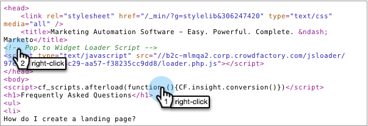

# Konverteringsskript för anpassade händelser {#conversion-script-for-custom-events}

Du definierar leveransmålet när du skapar ett hänvisningserbjudande. Om den åtgärd som är inriktad på målet är en specifik händelse på din egen webbsida kan du använda ett konverteringsskript för att anropa vårt JavaScript API.

## Hämta konverteringsskriptet {#retrieve-the-conversion-script}

1. Klicka på **Erbjudandeinformation** i offertredigeraren och välj sedan **Kundens JavaScript-händelse** i listrutan för mål.

   

1. Kopiera det översta skriptet i den grå rutan och placera det på webbsidan i `<body>` -taggarna. Det nedersta skriptet placeras inuti `<header>` -taggarna.

   

   >[!NOTE]
   >
   >**Påminnelse**
   >
   >
   >Kom ihåg att kopiera och klistra in båda skripten om de finns på en annan webbplats än Marketo.

## Hämta Loader-skriptet {#retrieve-the-loader-script}

1. Välj hänvisningserbjudandet i trädet, klicka sedan på **Erbjudandeåtgärder** och **Bädda in kod**.

   

1. Högerklicka på **sidhuvudskoden** och infoga den i sidhuvudet på webbsidan. Gör sedan samma sak med **Body Code**.

   

## Klistra in skript på din webbsida {#pasting-the-scripts-onto-your-webpage}

Klistra in konverteringsskripten i HTML för brödtexten och rubriken. Placera sedan inläsarskripten i HTML för brödtexten och rubriken.

## Ansluta konverteringsskriptet {#connecting-the-conversion-script}

Här skriver du en JavaScript-funktion som använder det specifika HTML-id:t för det sidelement som du vill aktivera målslutförandet för. Till exempel:

`<pre><em><!-- Referral offer conversion script --></em> </pre>` `<pre>`

I det här exemplet finns det en knapp på webbsidan med ID &quot;#myButtonId&quot;. När användaren klickar på den knappen registreras personen som slutförd målet.

Häftig! Er webbplats har nu hämtat skräddarsydda mål för social marknadsföring med Marketo.

>[!NOTE]
>
>**Relaterade artiklar**
>
>* [Ange mål för hänvisningserbjudande](../../../../product-docs/demand-generation/social/referral-offers/specify-goal-for-referral-offer.md)
>* [Skapa ett hänvisningserbjudande](../../../../product-docs/demand-generation/social/referral-offers/create-a-referral-offer.md)
>* [Distribuera sociala medier på din webbplats](deploy-social-on-your-website.md)

