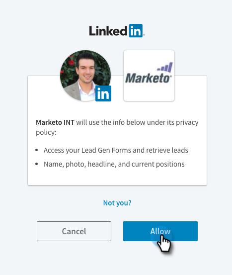

# Konfigurera LinkedIn Lead Gen Forms {#set-up-linkedin-lead-gen-forms}

Använd LinkedIn Lead Gen Forms för att köra annonskampanjer i LinkedIn och generera leads för Marketo.

>[!NOTE]
>
>* **Administratörsbehörigheter krävs**
>
>* När du skapar LinkedIn Lead Gen-formulär ska du kontrollera att formulärnamnet inte bara innehåller numeriska tecken. Formulärnamnet måste vara antingen alfabetiskt eller alfanumeriskt.
>
>* En LinkedIn-lead kommer inte till Marketo Engage om den matchar en befintlig personpost i Marketo som är kopplad till en företagspost som skapats med företags-API:er, och Marketo-prenumerationen inte är ansluten till någon CRM.

1. Gå till området **[!UICONTROL Admin]**.

   

1. Gå till **[!UICONTROL LaunchPoint]**, klicka på **[!UICONTROL New]** och välj **[!UICONTROL New Service]**.

   

1. Ange ett _visningsnamn_ för tjänsten, välj tjänsten **[!UICONTROL LinkedIn Lead Gen]** i listrutan och klicka på **[!UICONTROL Next]**.

   

1. Marketo öppnar en ny flik i samma webbläsare till [linkedin.com](https://www.linkedin.com){target="_blank"}. Logga in på LinkedIn med det konto som du vill använda för integreringen.

   >[!NOTE]
   >
   >LinkedIn-kontot behöver tillgång till alla LinkedIn Business-konton som du skapar sponsrade kampanjer för.

   

1. När du har loggat in på LinkedIn går du tillbaka till Marketo och klickar på **[!UICONTROL Authorize]**.

   

1. När du uppmanas till det klickar du på **[!UICONTROL Allow]** för att godkänna Marketo-programinstallationen i LinkedIn.

   

1. Du kommer att märka att du nu är auktoriserad. Klicka på **[!UICONTROL Next]**.

   

   >[!CAUTION]
   >
   >Tjänsten upphör automatiskt ett år efter auktoriseringen. Klicka bara på **[!UICONTROL Re-Authorize]** om du vill återfå åtkomst. Du kan behöva ange ditt LinkedIn-lösenord igen, beroende på inställningarna i webbläsaren.

1. Markera det/de konton du vill att LinkedIn-lead Gen ska komma till Marketo från och klicka på **[!UICONTROL Next]**.

   >[!TIP]
   >
   >Om du inte ser de företagskonton som du förväntar dig ska du se till att användarens LinkedIn-konto som auktoriseras har Lead Gen Form Manager-behörigheter till företagskontot i LinkedIn.

   

1. Om du vill acceptera standardfältkopplingar från LinkedIn till Marketo klickar du bara på **[!UICONTROL Create]**. Om du vill ändra standardfältmappningen, ta bort en fältmappning eller lägga till en ny fältmappning, kan du göra detta per fält via modalen nedan.

   >[!CAUTION]
   >
   >Marketo stöder mappning av två LinkedIn-fält till ett enda Marketo-fält, _, men bara när_ de två LinkedIn-fälten inte finns i samma formulär. Om du mappar två fält från samma LinkedIn-formulär till ett enda Marketo-fält kan det hända att ingen kan komma att ange din Marketo-databas.

   

   >[!NOTE]
   >
   >Endast LinkedIn-fält som redan har sparats i en [formulärmall](https://www.linkedin.com/help/lms/answer/79634){target="_blank"} i LinkedIn Campaign Manager visas som LinkedIn-fält som kan mappas till Marketo-fält.

   

Snyggt gjort! Personer som skickar in LinkedIn-formulär för Lead Gen börjar flöda in i Marketo när ni kör framgångsrika kampanjer på LinkedIn-sidan.

>[!NOTE]
>
>Du kan bara auktorisera ett enstaka LinkedIn-användarkonto. Om du har flera företagskonton som du vill länka till Marketo måste du se till att användarens LinkedIn-konto som auktoriseras har Lead Gen Form Manager-behörigheter till företagskontot i LinkedIn.

>[!MORELIKETHIS]
>
>[Använd LinkedIn-formulärfilter och utlösare för lead-generering i en smart kampanj](/help/marketo/product-docs/demand-generation/social/social-functions/use-linkedin-lead-gen-form-filters-and-triggers-in-a-smart-campaign.md){target="_blank"}
