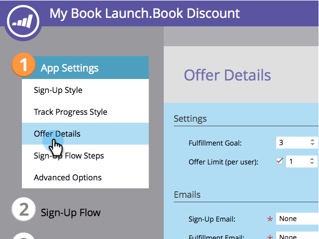

# Använd e-post i sociala kampanjer {#use-emails-in-social-promotions}

När du skapar ett [hänvisningserbjudande](../../../../product-docs/demand-generation/social/referral-offers/create-a-referral-offer.md) eller en [utlottning](../../../../product-docs/demand-generation/social/sweepstakes/create-sweepstakes.md)kan du inkludera e-postmeddelanden som skickas när personen registrerar sig och igen när personen har vunnit belöningen.

>[!TIP]
>
>Mer information om hur du skapar e-postmeddelanden finns i [Skicka en e-poststund](../../../../getting-started/quick-wins/send-an-email.md).

Använd följande variabler i e-postmeddelanden:

* **E-post** för registrering: Används **`{{social.Share Url}}`** för att skicka en personlig delningslänk till varje deltagare.

* **Fulfillment email**: Skicka **`{{social.Promo Code}}`** en [kampanjkod](use-promo-codes-for-offer-fulfillment.md)till varje vinnare.

>[!NOTE]
>
>**Förutsättningar**
>
>Innan du kan lägga till ett e-postmeddelande i en social app måste det vara *operativt* och *godkänt*. Se [Redigera inställningar för ett e-postmeddelande](../../../../product-docs/email-marketing/general/functions-in-the-editor/make-an-email-operational.md).

1. Gå till **marknadsföringsaktiviteter**.

   

1. Markera programmet och klicka på **Redigera utkast**.

   

1. Gå till **Appinställningar > Erbjudandeinformation** (eller **Information** om Lotteriet) i redigeraren för sociala appar.

   

1. Lägg till e-postmeddelandet om registrering.

   

   >[!NOTE]
   >
   >Bekräftelsemeddelandet skickas automatiskt när en person registrerar sig.

1. Lägg till e-postmeddelandet.

   

1. I ett hänvisningserbjudande väljer du om mejlet ska skickas automatiskt eller manuellt.

   

>[!NOTE]
>
>I utlottningar skickas e-postmeddelandet alltid automatiskt när du [väljer vinnaren](../../../../product-docs/demand-generation/social/sweepstakes/select-sweepstakes-winners.md).

>[!NOTE]
>
>**Definition**
>
>* **automatiskt på mål**: E-postmeddelandet skickas automatiskt när varje deltagare uppfyller målet.
>* **skicka** manuellt: När man börjat uppnå målet återgår man till hänvisningserbjudandet för att manuellt [skicka e-postmeddelandet](../../../../product-docs/demand-generation/social/referral-offers/send-referral-offer-fulfillment-email.md).

>

>[!NOTE]
>
>**Relaterade artiklar**
>
>Därefter kan du [välja URL](choose-the-share-url-for-a-social-app.md) för delning eller, i ditt erbjudande om att [skicka anmälan, ladda upp de kampanjkoder](use-promo-codes-for-offer-fulfillment.md) du skickar ut.

