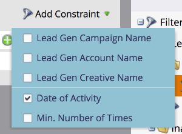

# Använd LinkedIn-formulärfilter och utlösare för lead-generering i en smart kampanj {#use-linkedin-lead-gen-form-filters-and-triggers-in-a-smart-campaign}

När du har aktiverat LinkedIn Lead Gen Forms kan du använda dem som filter och utlösare i smarta kampanjer.

>[!NOTE]
>
>När någon skickar sin information i ett LinkedIn Lead Gen-formulär skickas informationen direkt till Marketo och formuläret blir tillgängligt i listrutan Formulärnamn för leadgenerering. Formulärnamn visas inte förrän minst en person har skickat formuläret.

1. Använd utlösaren **[!UICONTROL Fills Out LinkedIn Lead Gen Form]** för att vidta åtgärder omedelbart eller filtret **[!UICONTROL Filled Out LinkedIn Lead Gen Form]** för schemalagda batchkampanjer eller standardfiltrering av smarta listor.

   

1. Lägg till begränsningar för att begränsa resultaten ytterligare.

   
