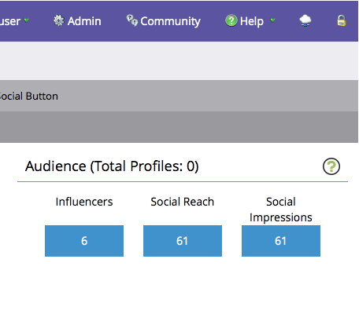
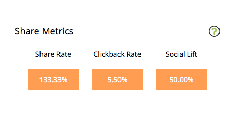

# Visa sociala prestanda {#view-social-performance}

Se de sociala aktiviteter som genereras av era sociala appar. Via den sociala instrumentpanelen får ni insikt i de olika sociala interaktioner som genereras av era sociala appar, och ni kan spåra resultatet för en social app.

>[!AVAILABILITY]
>
>Alla kunder har inte köpt den här funktionen. Kontakta din säljare för mer information.

1. Gå till **Marknadsföringsaktiviteter**.

   

1. Välj den sociala appen.

   

1. Klicka på **Aktivitetsdatum**.

   

1. Välj tidsintervall.

   

   >[!NOTE]
   >
   >Om du väljer **De senaste 24 timmarna** beräknas mätvärdena per timme, överst i timmen. För alla andra intervall körs mätvärden dagligen vid midnatt föregående dag.

1. Använd **den sociala tratten** för att se hur kampanjen fortskrider i sociala medier och hur effektiv den är.

   * **Kampanjbesök**: Antalet gånger som presumtiva kunder läser in en sida som innehåller din sociala app.
   * **Interaktioner**: Hur många gånger presumtiva kunder har interagerat med din sociala app, som att registrera sig för ett  [hänvisningserbjudande](/help/marketo/product-docs/demand-generation/social/referral-offers/create-a-referral-offer.md), rösta i en  [omröstning](/help/marketo/product-docs/demand-generation/social/creating-a-poll/create-a-poll.md),  [dela en video](/help/marketo/product-docs/demand-generation/landing-pages/free-form-landing-pages/add-a-video-to-a-free-form-landing-page.md) osv.
   * **Aktier**: Antalet gånger som potentiella kunder delar ett meddelande till sitt sociala nätverk från din sociala app.
   * **Resultatklickningar**: Antal gånger som potentiella kunder klickat på länkar i delningar från din sociala app.
   * **Registrering**: Antalet potentiella kunder som registrerar sig för kampanjen efter att ha följt en delad länk tillbaka till appen.

   >[!NOTE]
   >
   >Besök på en sida med flera appar för sociala medier räknas som ett besök på varje sida. Besök på flera sidor i samma app räknas som ett besök. Besök efter mer än 30 minuter, eller en omstart av webbläsaren, räknas som nya.

   

1. Använd panelen **Målgrupp** för att se hur dina potentiella kunder hjälper dig att få ut ordet.

   * **Totalt antal profiler**: Det totala antalet potentiella kunder som har loggat in på sociala nätverk från din sociala app.
   * **Påverkar**: Antalet potentiella kunder som har genererat minst ett resultatklick från en appresurs.
   * **Social räckvidd**: Summan av alla potentiella kunders förbindelser. För potentiella kunder som delar till sociala nätverk är det här antalet vänner de har när de delar från din sociala app. För e-postdelning är detta antalet mottagare av e-postmeddelandet som de genererar från din app.
   * **Sociala intryck**: Det totala antalet gånger som din sociala app har visats i flöden med potentiella kunder.

   

1. Använd panelen **Dela mått** för att granska den aggregerade sociala aktiviteten som genererats av din sociala app.

   * **Delningsfrekvens**: Andelen besök i appen som genererar en andel.
   * **Klickfrekvens**: Antalet resulterande klick per resurs.
   * **Social Lyft**: Förhållandet mellan besök i appen (som kommer från länken i delningar) och antalet icke-sociala besök (från andra källor än din sociala app).

   

>[!MORELIKETHIS]
>
>Ni kan också använda triggers och filter för att se vem som delar ert innehåll och interagerar med era sociala appar så att ni kan agera på dessa interaktioner. Se [Använd utlösare och filter för sociala aktiviteter](/help/marketo/product-docs/demand-generation/social/social-functions/triggers-and-filters-for-social-activities.md).
