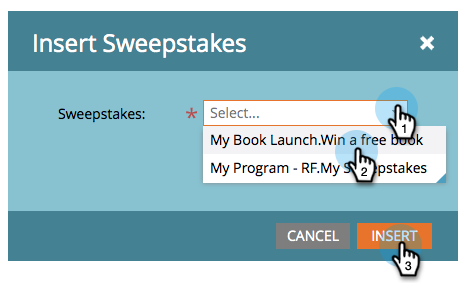

# Publicera Lotteriet {#publish-a-sweepstakes}

När du har [skapat utlottningar](create-sweepstakes.md)kan du publicera dem på din Markettill landningssidor, på din webbplats och på din Facebook.

>[!NOTE]
>
>**Tillgänglighet**
>
>Alla kunder har inte köpt den här funktionen. Kontakta din säljare för mer information.

>[!NOTE]
>
>**Påminnelse**
>
>Innan du publicerar ditt erbjudande, bekräfta att det uppfyller alla tillämpliga lagar, regler och bestämmelser.

1. Leta upp landningssidan och klicka på **Redigera utkast**.

   

1. Gå till avsnittet Infoga element till höger på sidan. Dra över **Lotteriet**.

   

1. Välj dina utlottningar och klicka på **Infoga**.

   

   >[!NOTE]
   >
   >**Påminnelse**
   >
   >
   >Du måste godkänna dina utlottningar för att kunna göra dem tillgängliga här.

   [publicera landningssidan på Facebook](../../../../product-docs/demand-generation/facebook/publish-landing-pages-to-facebook.md) [och lägga upp utlottningen på din webbplats](../../../../product-docs/demand-generation/social/social-functions/deploy-social-on-your-website.md)

   >[!TIP]
   >
   >Testa och förfina dina utlottningar. Gå till Lotteriet på din webbsida och registrera dig med testinformation. Notera allt du vill ändra om användarens upplevelse.

   >[!NOTE]
   >
   >När folk väl har börjat registrera sig, kom ihåg att gå tillbaka till appen för att [välja vinnarna](select-sweepstakes-winners.md)av utlottningen!

Grattis! Godkänn landningssidan och dina utlottningar är live. Du kan också eller .