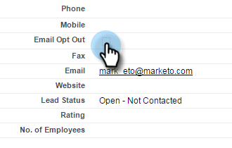

# Varaktigt avslut {#durable-unsubscribe}

Marketo har förbättrat beteendet för att avbryta prenumerationen så att den blir&quot;hållbar&quot;. Vi har lagt till en överordnad e-poststatus, som är skild från avregistreringsflaggan som visas på personinformationsposten.

Om flaggan för att avbryta prenumerationen är inställd på false uppdateras den överordnad e-poststatusen och ändringen sprids till andra personer med samma e-postadress. Om en person tas bort och återskapas, eller om en ny post skapas med samma e-postadress, skrivs den avslutande flaggan **inte** över.

>[!NOTE]
>
>Varaktigt Avbeställ fungerar för alla partitioner i hela Marketo-databasen.

## Uppdatera Unsubscribe Flag från True till False (t.ex. Resubscribe a Person) {#update-the-unsubscribe-flag-from-true-to-false-e-g-re-subscribe-a-person}

Det finns flera sätt att återprenumerera på en person.

**rensa** fältet E-posta avanmälan i lead/kontakts post i Salesforce. Detta synkroniseras med Marketo.

I Marketo avmarkerar du **rutan för att avbryta prenumerationen på fliken Info för personens post.**

Kör ett **Ändra datavärde**-flödessteg så som visas nedan på en eller flera personer.

Uppdatera en befintlig person via SOAP API.

## Skapa en ny person {#creating-a-new-person}

När en ny person skapas kontrollerar Marketo den mot den överordnad e-poststatustabellen. Om personen tidigare avbröt prenumerationen uppdaterar vi posten så att prenumerationen avbryts.

## Ändra en e-postadress {#changing-an-email-address}

Om du ändrar e-postadressen för en person till en e-postadress som du inte längre prenumererar på kommer personen att avbeställa prenumerationen. Den här ändringen kan inträffa i Marketo eller Salesforce.

Om du ändrar en e-postadress som du inte prenumererar på, kommer personen att prenumerera.

## Återprenumererar {#re-subscribing}

På samma sätt som ett avbrutet abonnemang skulle leda till att alla personer med samma e-postadress avbeställer prenumerationen skulle en återprenumeration faktiskt återbeställa alla personer med samma e-postadress.

## Aktivitetsloggen {#activity-log}

Ändringsdefinitioner för datavärde för *updateLeadEmailStatus* och *resetLeadEmailStatus* finns i [den här communityartikeln](http://nation.marketo.com/t5/Knowledgebase/Durable-Unsubscribe-Activity-Log/ta-p/252688).

>[!MORELIKETHIS]
>
>[Om att avbryta prenumerationen](understanding-unsubscribe.md)

