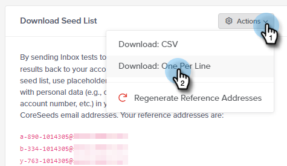
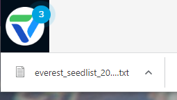

# Power Pack för e-postleverans: Så här importerar du en dirigeringslista {#email-deliverability-power-pack-how-to-import-a-seed-list}

En lista med dirigerade e-postkonton är en lista över e-postkonton hos flera postlådeproviders, inklusive Google Apps, Hotmail, Yahoo!, osv., som används för att beräkna andelen inkorg- och skräppostmappsleveranser. Så här hämtar du listan till din Marketo-instans.

>[!AVAILABILITY]
>
>Alla kunder har inte köpt den här funktionen. Kontakta din säljare för mer information.

## Importera en dirigerad lista {#import-a-seed-list}

1. I My Marketo väljer du **Leveransverktyg**.

   

1. Programmet Everest öppnas. Klicka på **Under flygning** och markera **Inkorgsplacering**.

   

1. Klicka på **Hantera startlista** -fliken.

   

1. Klicka på listrutan Åtgärder och välj **Ladda ned en per rad**.

   

   >[!NOTE]
   >
   >Använd optimering av dirigerad lista (längst upp på sidan) om du vill att Everest ska optimera listan åt dig.

1. Efter exporten visas listan som en TXT-fil i webbläsarens nedladdningsmapp. Hämta den och [import](/help/marketo/getting-started/quick-wins/import-a-list-of-people.md) i din Marketo-instans som en statisk lista.

   

   >[!TIP]
   >
   >Ge listan ett namn som gör det enkelt att hitta.

   >[!CAUTION]
   >
   >Du får ett begränsat antal av dessa kampanjer för inkorgsplacering per månad. Om du vill se hur många du får kan du titta i prenumerationsdelen under Kontoinställningar > Prenumeration i Everest. Kontakta din Marketo-säljare om du vill ha mer information.

## Hämtar nya dirigeringslistor {#acquiring-new-seedlists}

Din dirigeringslista kan ändras så ofta som varje månad. Det är viktigt att du regelbundet loggar in på e-postleverantörens Power Pack och kontrollerar statusen för din dirigeringslista. När nya adresser läggs till eller en uppdatering krävs får du ett meddelande via meddelandeikonen längst ned till vänster i programmet.

När den statiska listan i Marketo har skapats kan du börja skicka till den för att testa e-postens placering i inkorgen.
