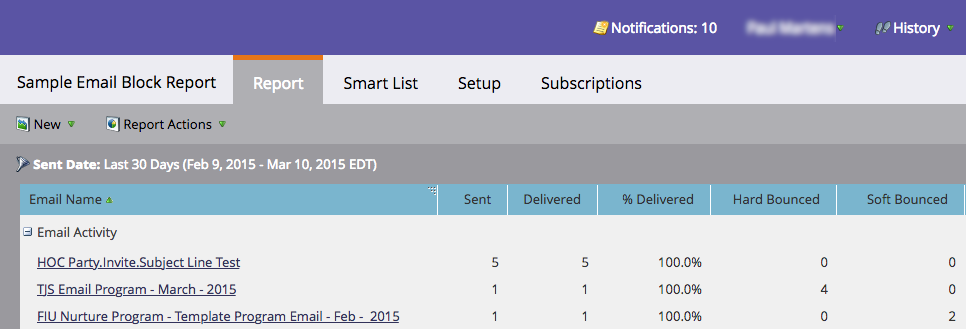

# Hårda och mjuka studsar i e-postmeddelanden {#hard-and-soft-bounces-in-email}

Ett hårt studsande kan göra en persons e-postadress ogiltig när en e-postserver meddelar Marketo att personens e-postadress inte kan levereras. Ett mjukt studs innebär att något gick fel när e-postmeddelandet skulle skickas till personen. Detta löses automatiskt och kan ibland ta dagar. Både hårda och mjuka studsar består av [flera kategorier](https://nation.marketo.com/t5/Knowledgebase/Maintaining-a-Directory-of-Leads-Bouncing-Emails/ta-p/300838).

## Studsklassificering {#bounce-classification}

Det finns fem personsträngar i Marketo som är relaterade till problematisk e-postleverans.

1. **E-post pausad** - Ange som True när en viss typ av hård studsning inträffar.
1. **E-postmeddelandet har avbrutits, orsak** - Det kan finnas många orsaker. Det här fältet försöker förklara orsaken.
1. **E-postmeddelandet har pausats** - När den felaktiga studsen inträffar gör Marketo uppehåll i e-postutskicket till personen i 24 timmar från den här tidsstämpeln.
1. **Ogiltig e-post** - Ange som Sant när en viss typ av hård studs inträffar.
1. **E-posta ogiltig orsak** - Orsaken till den hårda studsen.

>[!NOTE]
>
>När en person når statusen **e-postpausad** går det inte att avmarkera kryssrutan för pausad e-post. Personen kommer dock fortfarande att kunna mejlas 24 timmar efter det första uppehållet.
>
>När en person har markerats som **e-post ogiltig** kan de bara återställas manuellt (vilket vi rekommenderar att du bara gör om du vet att vissa e-postmeddelanden är giltiga) genom att avmarkera rutan E-post ogiltig på fliken Personinformation i posten.

>[!PREREQUISITES]
>
>Följ [de här stegen](/help/marketo/product-docs/email-marketing/email-programs/email-program-data/email-performance-report.md) för att skapa en e-postprestandarapport som genererar studsdata.

När du har skapat din e-postprestandarapport ska skärmen se ut ungefär så här:

>[!NOTE]
>
>Skräppostfilter skapar ibland hårda studsar. Dessa &quot;falskt positiva&quot; är inte en indikation på giltigheten för personens e-postadress.
