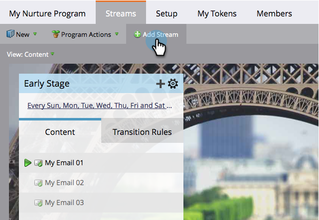

# Lägg till en ström {#add-a-stream}

Engagemangsprogram kan innehålla mer än en ström. Så här lägger du till en ny.

1. Gå till **Marknadsföringsaktiviteter**.

   

1. Välj ditt engagemangsprogram och klicka på fliken **Streams**.

   

1. Klicka på **Lägg till ström**.

   

   >[!NOTE]
   >
   >Ni kan lägga till upp till 25 strömmar per engagemangsprogram.

   Och... klart!

   
