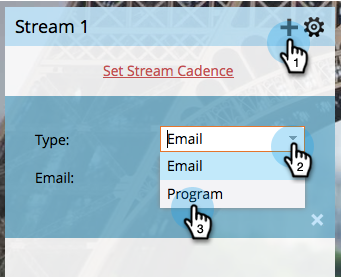

# Lägg till innehåll i en ström {#add-content-to-a-stream}

När ni väl har skapat ert engagemangsprogram måste ni lägga till innehåll i strömmarna. Du kan lägga till e-post eller program i en ström.

## Lägg till en e-postadress i en ström {#add-an-email-to-a-stream}

1. Gå till **marknadsföringsaktiviteter**.

   

1. Välj engagemangsprogram och gå till fliken **Streams** .

   

   Du kan lägga till det första e-postmeddelandet på tre olika sätt:

**Knappen Lägg till innehåll**

1. Klicka på knappen **Lägg till innehåll** .

   

1. Låt **Type** vara **Email** och välj sedan det e-postmeddelande du vill lägga till.

   

   >[!TIP]
   >
   >E-postmeddelanden som är lokala för det här engagemangsprogrammet sorteras överst.

**Strömma + ikon**

1. Klicka på ikonen för direktuppspelning **+** , lämna **Type** som **e-post** och välj det e-postmeddelande som du vill lägga till.

   

**Dra och släpp**

1. Bara dra e-postmeddelandet från trädet till strömmen.

   

## Lägg till ett program i en ström {#add-a-program-to-a-stream}

1. Gå till **marknadsföringsaktiviteter**.

   

1. Välj engagemangsprogram och gå till fliken **Streams** .

   

   Du kan lägga till ett program i strömmen på tre olika sätt:

**Knappen Lägg till innehåll**

1. Klicka på **Lägg till innehåll**.

   

1. Ändra **typ** till program.

   

1. Hitta och välj programmet.

   

1. Välj nu den smarta kampanjen i programmet som du vill att folk ska gå igenom.

   

   >[!NOTE]
   >
   >**Påminnelse**
   >
   >
   >Den smarta kampanjen måste ha filtret **Member of Engagement Program** för att den ska fungera korrekt.

**Strömma + ikon**

1. Klicka på direktuppspelningsikonen **+** och ändra sedan **Type** till Program.

   

1. Hitta och välj program.

   

1. Välj den smarta kampanj som du vill att personerna ska behandlas i.

   

**Dra och släpp**

1. Dra och släpp önskat program från trädet i strömmen.

   

1. Välj nu bara den smarta kampanj ni vill att folk ska flöda igenom.

   

Bra jobbat! Nu kan du lägga till innehåll i programströmmar på olika sätt. Lägg till så många du behöver för din näring. Mer information finns i den relaterade artikeln nedan.

>[!NOTE]
>
>**Relaterade artiklar**
>
>* [Lägga till ett program i en Engagement Program Stream](adding-a-program-to-an-engagement-program-stream.md)

>

