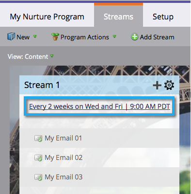

# Förstå engagemangsprogram {#understanding-engagement-programs}

Engagemangsprogram är utformade för att marknadsföra innehåll till nya människor genom att presentera det på ett systematiskt sätt.

>[!NOTE]
>
>**FYI**
>
>Marketo standardiserar nu språk för alla prenumerationer, så du kan se lead/leads i din prenumeration och person/personer på docs.marketo.com. Dessa termer betyder samma sak. det påverkar inte artikelinstruktionerna. Det finns andra förändringar också. [Läs mer](http://docs.marketo.com/display/DOCS/Updates+to+Marketo+Terminology).

>[!NOTE]
>
>Det finns en gräns på 100 **aktiva** engagemangsprogram per prenumeration.

## Engagement Program {#engagement-program}

Ett **engagemang pr****ogram** är en typ av program som enkelt kan åstadkomma komplexa uppfödningar.

Relaterad artikel:

* [Skapa ett engagerande program](create-an-engagement-program.md)

## Strömma {#stream}

En **ström** är en pool av prioriterat innehåll som engagemangsprogrammet kommer att använda för att vårda människor.

Relaterade artiklar:

* [Lägg till en ström](add-a-stream.md)
* [Klona en ström](../../../../product-docs/email-marketing/drip-nurturing/engagement-program-streams/clone-a-stream.md)

## Innehåll {#content}

Det finns två typer av **innehåll** du kan lägga till i engagemangsprogramströmmar - e-post och program. E-post skickas till folk vid sändning.

Relaterade artiklar:

* [Lägg till innehåll i en ström](add-content-to-a-stream.md)
* [Prioritera ströminnehåll](../../../../product-docs/email-marketing/drip-nurturing/using-stream-content/prioritize-stream-content.md)
* [Redigera tillgänglighet för direktuppspelat innehåll](../../../../product-docs/email-marketing/drip-nurturing/using-stream-content/edit-availability-of-stream-content.md)
* [Ta bort ströminnehåll](../../../../product-docs/email-marketing/drip-nurturing/using-stream-content/remove-stream-content.md)
* [Arkivera och arkivera ströminnehåll](../../../../product-docs/email-marketing/drip-nurturing/using-stream-content/archive-and-unarchive-stream-content.md)

## Kast {#cast}

En **sändning** är händelsen att skicka e-postmeddelanden från ett engagemangsprogram.

>[!NOTE]
>
>Partnerskapsprogram är inte utformade för att användas med operativa e-postmeddelanden.

## Stream Cadence {#stream-cadence}

Du bestämmer när en sändning ska ske genom att ställa in **strömcadence**. Så här schemalägger du innehåll som ska gå ut med regelbundna intervall.

` 

`

Relaterad artikel:

* [Ange strömavslut](../../../../product-docs/email-marketing/drip-nurturing/engagement-program-streams/set-stream-cadence.md)

## Person Cadence {#person-cadence}

En **personcadence** är en status som definierar dess förmåga att ta emot innehåll från ett engagemangsprogram. Du kan använda flödessteget **Ändra programstängning** för att ändra det till Pausad eller Normal.

` 

`

## Utmattad {#exhausted}

När en person har fått allt innehåll i en ström kallar vi den person som är **utled**.

>[!MORELIKETHIS]
>
>* [Personer som har fyllt i innehåll](../../../../product-docs/email-marketing/drip-nurturing/using-engagement-programs/people-who-have-exhausted-content.md)

>

## Innehållsengagemangsnivå {#content-engagement-level}

Content Engagement Level är en poängnivå på 0 till 100 poäng som Marketo kommer att ge ert innehåll. Talet bestäms av en avancerad formel som använder öppningar, klickningar, avanmälan, programframgångar och andra faktorer.

>[!MORELIKETHIS]
>
>* [Så här fungerar engagemanget](../../../../product-docs/email-marketing/drip-nurturing/reports-and-notifications/understanding-the-engagement-score.md)

>

