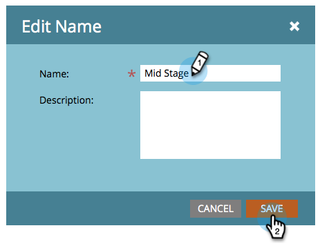

# Byt namn på en ström {#rename-a-stream}

Om du vill kunna hålla ordning kan du byta namn på strömmarna. Så här gör du.

1. Hitta och välj ditt engagemangsprogram och klicka sedan på **Streams**.

   

1. Dubbelklicka på det aktuella strömmens namn.

   

1. Ange den nya strömmen **Namn** och klicka på **Spara**.

   

   Och voila! Nu vet du hur man byter namn på strömmar.

