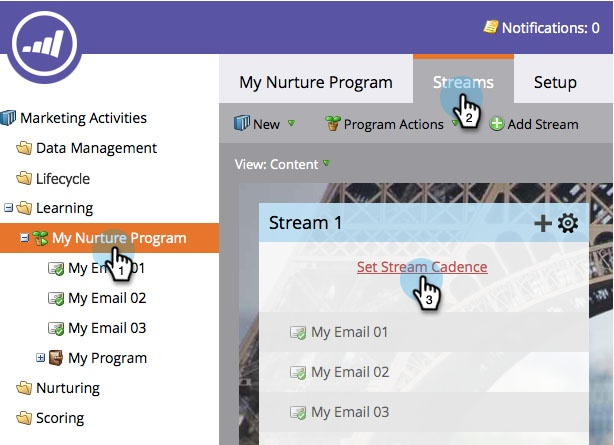
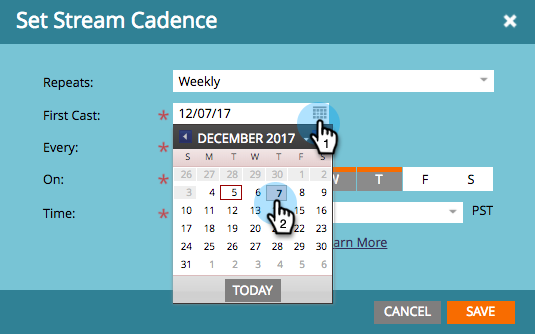

# Ange strömavslut {#set-stream-cadence}

Ni kan skicka engagemangsinnehåll när ni vill. Till exempel: en gång i veckan, eller var tredje tisdag i månaden.

## Ange hörnpunkt {#set-cadence}

1. Gå till **marknadsföringsaktiviteter**.

   

1. Hitta och välj engagemangsprogram, klicka på fliken **Streams **och klicka sedan på **Set Stream Cadence**.

   

1. Välj hur ofta du vill att cadence ska upprepas. Du kan välja** Varje vecka** eller **Varje månad**.

## Vecka {#weekly}

1. Välj **Varje vecka**.

   

   >[!NOTE]
   >
   >Om du väljer **Ingen **stängs strömmen av.

1. Välj datum för den första omgången.

   

1. Välj nu om du vill att stängslet ska hända varje vecka eller mer. Vi väljer varannan vecka.

   

1. Bestäm vilka veckodagar. I det här fallet ska vi göra tisdag, onsdag och torsdag.

   

   >[!TIP]
   >
   >Du kan ange att din cadence ska köras varje dag genom att välja **Upprepningar: Varje vecka** /** var: 1 vecka** /** ****På**: alla dagar.

   Välj tid nu. Markera rutan om du vill använda [Mottagarens tidszon](set-stream-cadence/schedule-engagement-programs-with-recipient-time-zone.md)(d.v.s. leverera enligt lokala tidszoner) och klicka sedan på Spara.
   

   >[!CAUTION]
   >
   >Innehållet kommer att publiceras det datum du valde för den första omgången, så se till att det sammanfaller med den veckodag du väljer; i annat fall kommer det att gå ut två gånger under den första veckan.

1. Hovra över staketet. Du får se vilka dagar som framtida sändningar kommer att gå ut.

   

   >[!NOTE]
   >
   >I det här exemplet kommer ett e-postmeddelande att skickas på torsdag. Vi hoppar sedan över en vecka och skickar igen tisdag, onsdag och torsdag nästa vecka. Och sen slingrar vi igen.

Så ja! Fortsätt läsa om du vill konfigurera en månadskurs.

## Månadsvis {#monthly}

1. Välj **Monthly **om du vill se hur ofta den upprepas.

   

1. Välj datum för den första omgången.

   

1. Välj om du vill att den ska vara varje månad eller mer utspridd... Vi väljer var fjärde månad.

   

1. Välj vilken dag i månaden du angav, i det här fallet den 22 i var fjärde månad.

   

   >[!TIP]
   >
   >Du kan också välja veckodag.

1. Välj en **tid** och klicka på **Spara**.

   

1. Hovra över staketet. Du får se vilka dagar som framtida sändningar kommer att gå ut.

   

   >[!CAUTION]
   >
   >Om du bestämmer dig för att ändra din interaktionsströmscache senare kontrollerar du att den första konverteringen är inställd på ett framtida datum.

Nu vet du hur man lägger upp en strömcadence!

>[!NOTE]
>
>**Relaterade artiklar**
>
>* [Förstå mottagartidszon](../../../../product-docs/email-marketing/email-programs/email-program-actions/scheduling-with-recipient-time-zone/understanding-recipient-time-zone.md)
>* [Schemalägg engagemangsprogram med mottagartidszon](set-stream-cadence/schedule-engagement-programs-with-recipient-time-zone.md)

>

