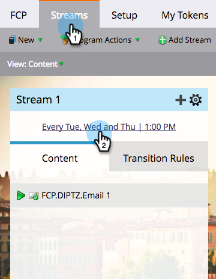

# Schemalägg engagemangsprogram med mottagartidszon {#schedule-engagement-programs-with-recipient-time-zone}

När du schemalägger en interaktionsprogramström och mottagarens tidszon är aktiva, kommer programsändningen att börja köras vid midnatt i den första tidszonen (UTC +14:00). Vi kräver att du schemalägger den första sändningen **minst 25 timmar** i framtiden eftersom det kan finnas personer som kvalificerar sig för typsnittet i varje tidszon över hela världen. Om vi påbörjar bearbetningen vid den här tidpunkten i den första tidszonen garanterar vi att vi kommer att leverera e-postmeddelandet vid det schemalagda datumet och den schemalagda tidpunkten för varje mottagare.

1. Gå till **Strömmar** och klicka på ett strömmens cadence-schema för att redigera det.

   

1. [Ange inställningar för din närvaro](/help/marketo/product-docs/email-marketing/drip-nurturing/engagement-program-streams/set-stream-cadence.md) som vanligt, kontrollera sedan **Mottagarens tidszon** box. Kom ihåg att din första sändning måste vara minst 25 timmar i framtiden. Klicka **Spara**.

   

1. Observera att när mottagartidszon är aktiv visas ingen specifik tidszon i schemat för stängning, eftersom det kan finnas flera. Den visar bara timmen.

   

>[!MORELIKETHIS]
>
>* [Förstå mottagartidszon](/help/marketo/product-docs/email-marketing/email-programs/email-program-actions/scheduling-with-recipient-time-zone/understanding-recipient-time-zone.md)
>* [Ange strömavslut](/help/marketo/product-docs/email-marketing/drip-nurturing/engagement-program-streams/set-stream-cadence.md)
