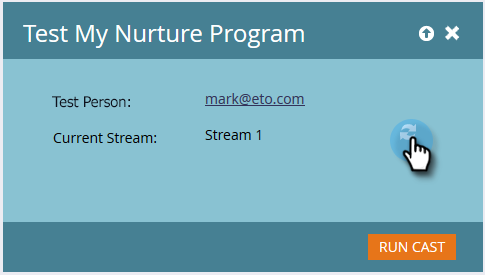

# Testa en engagemangsström {#test-an-engagement-stream}

När du har lagt till allt innehåll i en ström kan du testa dem en bit i taget.

1. Gå till **[!UICONTROL Marketing Activities]**.

   

1. Välj engagemangsprogram.

   

1. Klicka på **[!UICONTROL Program Actions]** och välj **[!UICONTROL Test Stream]**.

   

1. Välj din person i listrutan **[!UICONTROL Test Person]**. Kom ihåg att innehåll faktiskt kommer att gå ut, så tänk på det när du väljer.

   

   >[!CAUTION]
   >
   >Kontrollera att din testperson är unik och inte har några dubbletter i databasen.

   >[!TIP]
   >
   >Om den testperson du söker inte finns kan du skapa en direkt med alternativet **[!UICONTROL Create Person]**.

   Klicka på **[!UICONTROL Initial Stream]**, markera den ström som du vill testa och klicka på **[!UICONTROL Run Cast]**.
   

1. Klicka på ikonen Uppdatera när personen har gått igenom de [övergångsregler](/help/marketo/product-docs/email-marketing/drip-nurturing/engagement-program-streams/transition-people-between-engagement-streams.md) som du tidigare har konfigurerat.

   

1. Den nya strömmen visas, vilket anger att testet lyckades.

   

   Bra jobbat!

   >[!NOTE]
   >
   >Inget annat innehåll skickas om du inte klickar på **[!UICONTROL Run Cast again]**.
