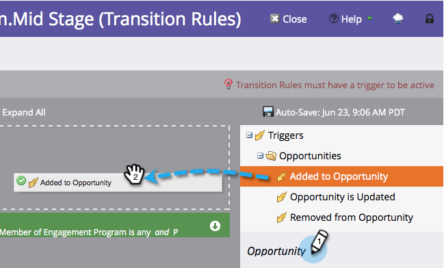

# Överför personer mellan engagemangsströmmar {#transition-people-between-engagement-streams}

Engagement-program kan ha fler än en ström. Om du [lägger till en ström](../../../../product-docs/email-marketing/drip-nurturing/creating-an-engagement-program/add-a-stream.md) måste du definiera ett sätt för personer att flytta från en ström till en annan. Dessa kallas **övergångsregler.**

1. Gå till **Marknadsföringsaktiviteter**.

   

1. Välj ditt multistreaming-engagemangsprogram och gå till **Streams**.

   

1. Klicka på **Övergångsregler** för den ström du vill hämta från andra strömmar och klicka sedan på **Redigera övergångsregler. **

   

   >[!NOTE]
   >
   >Övergångsregler dras in i en ström. definierar alltid reglerna för den ström som du vill hämta till.

   När fönstret med övergångsregeln öppnas kan du söka efter och dra i valfri utlösare. I det här fallet vill vi flytta personer till Mid Stage när det läggs till i en affärsmöjlighet.
` 

   `

1. Låt oss ställa in operatorn på** är vilket** som helst, så att personerna kan gå över för nya möjligheter.

   ` 

   `

   >[!TIP]
   >
   >Du kan lägga till flera utlösare och filter i en övergångsregel, men övergångsregeln använder alla filter (det enda alternativet är att använda ALLA filter). Om du behöver använda ELLER i en övergångsregel rekommenderar vi att du i stället skapar en extern smart kampanj.

1. Klicka på **Stäng**.

   

   Bra! Nu kommer alla personer i ditt engagemangsprogram som läggs till i en affärsmöjlighet att flyttas till Mid Stage-strömmen.

   ` 

   `

   >[!NOTE]
   >
   >Stegen ovan *do* gäller även personer som är [på paus](http://docs.marketo.com/display/DOCS/Pause+People+in+an+Engagement+Program).

