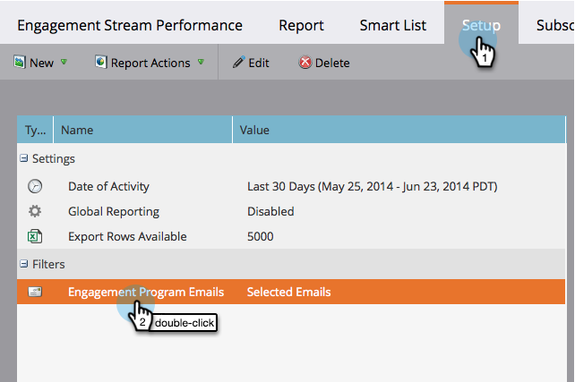

# Resultatrapport för engagemangsström {#engagement-stream-performance-report}

Vill du veta hur engagemangsinnehållet fungerar? Testa rapporten om hur engagemangsströmmen fungerar.

## Skapa rapporten {#create-the-report}

1. Hitta och välj ditt engagemangsprogram och klicka sedan på **Nytt** **Ny lokal resurs** under &lt;a0/>Nytt&lt;a1/>.

   

1. Välj **Rapport**.

   

   >[!TIP]
   >
   >Om du skapar rapporten i programmet begränsas den automatiskt till innehållet i programmet.

   Välj Prestanda för avtalsström som rapporttyp.
   

1. Namnge rapporten och klicka på **Skapa**.

   

   Okej! Nu ska vi kolla in inställningarna.

## Redigera inställningar {#edit-settings}

1. Hitta och välj rapporten.

   

1. Under fliken **Setup** dubbelklickar du på filtret **Engagement Program Email**.

   

1. Markera de e-postmeddelanden som du vill rapportera om och klicka på **Använd**.

   

## Kör rapport {#run-report}

1. Klicka på fliken **Rapport** om du vill köra rapporten.

   

   >[!TIP]
   >
   >
   >Även om det inte finns någon illustration är Engagement Score en kolumn i den här rapporten. Mer information om vad det är finns i [Förstå engagemangspoängen](understanding-the-engagement-score.md).

   Bra jobbat! Observera att rapporten grupperas efter engagemangsprogram.

