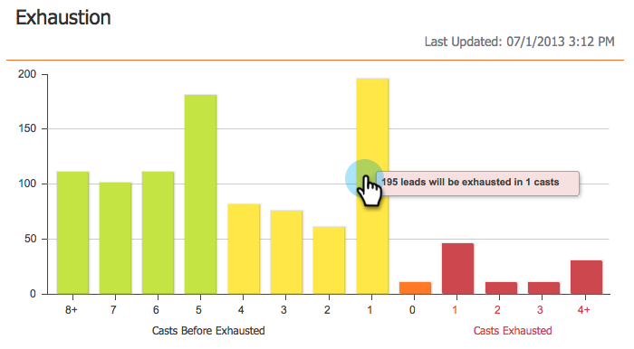
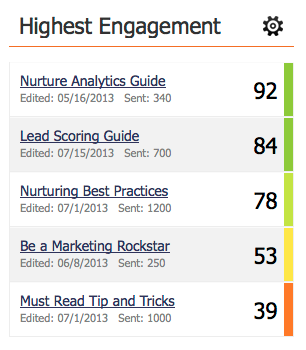
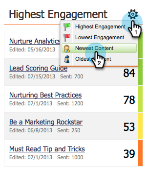

# Instrumentpanelen för engagemang {#the-engagement-dashboard}

Engagement Dashboard är det enklaste sättet att se hur innehållet i era [engagemangsprogram](http://docs.marketo.com/display/docs/drip+nurturing) fungerar.

>[!NOTE]
>
>Förlovningsresultatet beräknas 72 timmar efter varje sändning. Läs mer om [engagemangspoängen](understanding-the-engagement-score.md).

## Visa instrumentpanelen för engagemang {#view-the-engagement-dashboard}

Välj ditt engagemangsprogram och klicka på **Visa > Kontrollpanel**.

>[!TIP]
>
>Mer detaljerad statistik finns i rapporten [om hur](engagement-stream-performance-report.md) engagemangsströmmen fungerar.

## Förstå utgiftswidgeten {#understand-the-exhaustion-widget}

Med den här widgeten kan du förutse när leads har fyllt allt innehåll. Utmattningspoängen beräknas omedelbart efter varje sändning. Exemplet nedan visar att 195 leads i en omgång har uttömt allt innehåll.

>[!NOTE]
>
>Du måste gå till fliken Inställningar och se till att meddelanden om utfyllt innehåll är **aktiverade** för att se diagrammet ovan. Om de är avaktiverade ser diagrammet annorlunda ut.

>[!CAUTION]
>
>Personer som är &quot;utmattade&quot; kommer inte att få något meddelande i nästa sändning.

## Förstå engagemanget över tidswidgeten {#understand-the-engagement-over-time-widget}

Visar den genomsnittliga engagemangspoängen över tid och effekten av innehållsredigeringar.

>[!NOTE]
>
>**Tillgänglighet**
>
>Den här funktionen är tillgänglig som ett tillägg för kunder som använder Marketos intäktscykel Explorer. Kontakta din Customer Success Manager om du vill ha mer information.

Om du vill visa en enstaka del av innehållet i stället för ett genomsnitt klickar du på kugghjulsikonen och markerar sedan innehållet.

## Förstå widgeten för högsta engagemang {#understand-the-highest-engagement-widget}

En lista över allt innehåll, ordnade efter högsta engagemangspoäng.

Om du vill ändra sorteringen klickar du på kugghjulsikonen och väljer sedan sorteringsordningen.

*Nyaste* och *Äldsta* baseras på tiden för senaste godkännande.

>[!NOTE]
>
>**Djupdykning**
>
>Läs mer i [Create an Engagement Program](../../../../product-docs/email-marketing/drip-nurturing/creating-an-engagement-program/create-an-engagement-program.md) .

