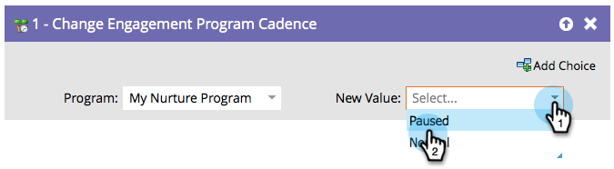

# Pausa personer i ett engagemangsprogram {#pause-people-in-an-engagement-program}

När en person är medlem i ett engagemangsprogram får han/hon tillgång till innehåll tills han/hon har [fyllt allt innehåll](people-who-have-exhausted-content.md). Du kan använda flödessteget [Change Engagement Program Cadence](../../../../product-docs/core-marketo-concepts/smart-campaigns/program-flow-actions/change-engagement-program-cadence.md) för att hindra personer från att ta emot innehåll, även om de inte har uttömt innehållet än.

1. Välj engagemangsprogrammet.

   

1. Välj **Pausad **som **Nytt värde** om du vill hindra personen från att ta emot innehåll.

   

   Du kan återställa personen till **Normal** om du vill att de ska börja ta emot innehåll igen. De återupptas där de slutade.

   >[!NOTE]
   >
   >Om du pausar en person kommer de inte att kunna ta emot innehåll, men de kommer fortfarande att gå mellan strömmar om de uppfyller villkoren.

