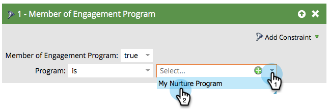

# Personer som har fyllt i innehåll {#people-who-have-exhausted-content}

>[!NOTE]
>
>**FYI**
>
>Marketo standardiserar nu språk för alla prenumerationer, så du kan se lead/leads i din prenumeration och person/personer på docs.marketo.com. Dessa termer betyder samma sak. det påverkar inte artikelinstruktionerna. Det finns andra förändringar också. [Läs mer](http://docs.marketo.com/display/DOCS/Updates+to+Marketo+Terminology).

När en person har fått allt innehåll i en ström har den uttömt alla möjligheter och väntar tills fler läggs till. Du kan hitta personer som är &quot;utmattade&quot; på flera sätt.

## Medlem i Engagement Program-filtret {#member-of-engagement-program-filter}

1. Skapa en ny smart lista och sök och dra sedan i filtret **Medlem i engagemangsprogrammet** .

   

1. Hitta och välj det engagemangsprogram där du kan hitta utmattade människor.

   

1. Under **Lägg till begränsning** väljer du **Utfyllt innehåll**.

   

1. Ställ in **Utfyllt innehåll** till **true**.

   

   Kör bara den här smarta listan för att se en lista över personer som har uttömt allt innehåll i strömmen de befinner sig i.

## Fliken Medlemmar {#members-tab}

1. Gå till **marknadsföringsaktiviteter**.

   

1. Välj ditt engagemangsprogram och gå till fliken **Medlemmar** .

   

1. Lägg märke till kolumnen med namnet **Utfyllt innehåll**.

   

   Detta visar er som har uttömt allt innehåll och de som inte har det.

## Strömma {#stream}

1. Du kan också se det totala antalet personer som har slut på innehåll på fliken Streams i själva strömmen.

   

   >[!NOTE]
   >
   >Numret uppdateras omedelbart efter varje sändning.

