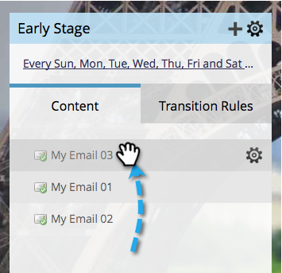

# Prioritera ströminnehåll {#prioritize-stream-content}

När du har lagt till innehåll i strömmen kanske du vill ändra prioriteten. Innehållet levereras alltid uppifrån och ned i varje sändning och inget innehåll skickas till samma person två gånger.

1. Gå till **Marknadsföringsaktiviteter**.

   

1. Välj ditt engagemangsprogram och klicka på fliken **Streams**.

   

1. Dra och släpp innehållet i den ordning du vill ha det.

   

   >[!NOTE]
   >
   >Prioriteten läses alltid uppifrån och ned vid typkonverteringen.

   Så enkelt är det! Nu vet ni hur ni prioriterar ert ströminnehåll.
