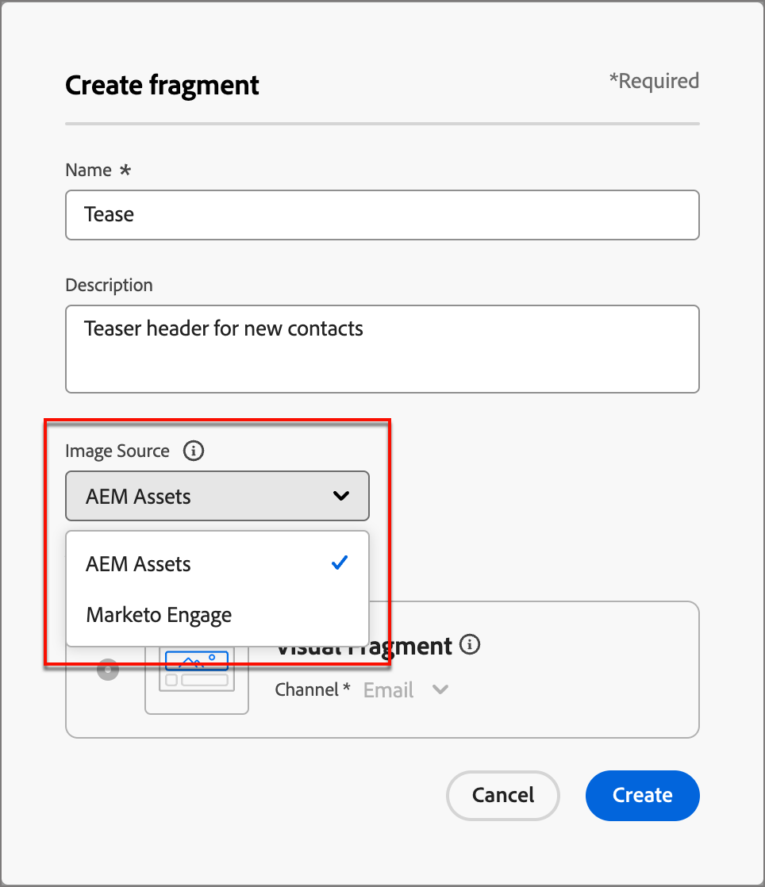

# Arbeta med Experience Manager resurser {#work-with-experience-manager-assets}

Samla marknadsförings- och kreativa arbetsflöden med Adobe Experience Manager Assets. Den är inbyggd i Marketo Engage, så du kan enkelt komma åt _Assets as a Cloud Service_ och upptäcka och använda digitala resurser för att fylla i dina meddelanden.

Adobe Experience Manager _Assets as a Cloud Service_ är en lättanvänd molnlösning för effektiv hantering av digitala resurser och dynamiska media. Läs mer i dokumentationen för [Adobe Experience Manager as a Cloud Service](https://experienceleague.adobe.com/sv/docs/experience-manager-cloud-service/content/assets/overview).

>[!PREREQUISITES]
>
>* Licenser för _Assets as a Cloud Service_ och Dynamic Media krävs för integreringen. Kontrollera att [Dynamiska media med Open API är aktiverat](https://experienceleague.adobe.com/sv/docs/experience-manager-cloud-service/content/assets/dynamicmedia/dynamic-media-open-apis/dynamic-media-open-apis-overview#enable-dynamic-media-open-apis). Beroende på ditt kontrakt och din konfiguration kan du komma åt Adobe Experience Manager _Assets as a Cloud Service_ direkt från Marketo Engage när du utformar visuellt innehåll.

>[!NOTE]
>
>För närvarande stöds endast bildresurser från _Adobe Experience Manager Assets_ i Marketo Engage. Ändringar av mediefilerna måste göras från Adobe Experience Manager Assets centrala arkiv. [Läs mer](https://experienceleague.adobe.com/sv/docs/experience-manager-cloud-service/content/assets/manage/manage-digital-assets){target="_blank"}

## Länka till dina AEM Cloud-tjänster {#link-to-your-aem-cloud-services}

Innan du kan använda den här funktionen måste du först länka AEM Cloud Services till Adobe Marketo Engage.

+++Länka AEM Cloud-tjänster och Marketo Engage

>[!NOTE]
>
>**Administratörsbehörigheter krävs**

1. Gå till området **Admin** i Marketo Engage och välj **Adobe Experience Manager** i det vänstra navigeringsträdet.

   {width="800" zoomable="yes"}

1. Klicka på **Redigera** bredvid _Adobe Experience Manager Cloud Services_.

   {width="400" zoomable="yes"}

1. Markera en eller flera databaser.

   {width="800" zoomable="yes"}

   >[!NOTE]
   >
   >* Endast databaser som har kopplats till samma IMS-organisation som din Marketo Engage-prenumeration visas.
   >
   >* Marketo Engage stöder endast databaser från leveransnivån. Om du använder redigeringsnivån och vill konvertera den kontaktar du [Adobe Experience Manager Support](https://experienceleague.adobe.com/sv/docs/experience-manager-cloud-manager/content/overview/help-resources).

1. Du måste lägga till ett [certifikat för tjänstautentiseringsuppgifter](https://experienceleague.adobe.com/sv/docs/experience-manager-learn/getting-started-with-aem-headless/authentication/service-credentials) för att konfigurera databasen. Klicka på knappen **+ Lägg till certifikat**.

   {width="800" zoomable="yes"}

1. Dra och släpp ditt certifikat (endast JSON-filen) eller välj det på datorn. Klicka på **Lägg till** när du är klar.

   {width="600" zoomable="yes"}

1. Den konfigurerade databasen visas nedan tillsammans med status och utgångsdatum. Klicka på ellipsknappen (**..**) för att visa certifikatet. Annars är du klar.

   {width="700" zoomable="yes"}

Nu kan du komma åt alla bilder från det digitala resurshanteringsbiblioteket i den databasen via Marketo Engage Email Designer.

+++

## Arbeta med AEM-resurser {#working-with-aem-assets}

När du använder dessa digitala resurser sprids de senaste ändringarna i _Assets as a Cloud Service_ automatiskt till e-postkampanjer via länkade referenser. Om bilder tas bort i _Adobe Experience Manager Assets as a Cloud Service_ visas bilderna med en bruten referens i dina e-postmeddelanden. När resurser som för närvarande används i Marketo Engage ändras eller tas bort meddelas e-postförfattarna om bildändringarna. Alla ändringar av materialet måste göras i Adobe Experience Manager Assets centrala arkiv.

### Använd AEM Assets som bildkälla {#use-aem-assets-as-the-image-source}

Om din miljö har en eller flera anslutningar till resurskatalogen kan du ange AEM Assets som källa för resurser när du skapar eller visar information för ett e-postmeddelande, en e-postmall eller ett visuellt fragment.

* När du skapar nytt innehåll väljer du `AEM Assets` som **[!UICONTROL Image Source]**-objekt i dialogrutan.

{width="400" zoomable="yes"}

* När du öppnar en befintlig innehållsresurs väljer du `AEM Assets` i avsnittet _[!UICONTROL Body]_&#x200B;till höger.

{width="700" zoomable="yes"}

### Få åtkomst till resurser för redigering {#access-assets-for-authoring}

>[!IMPORTANT]
>
>En administratör måste lägga till användare som behöver tillgång till resurser i produktprofilerna Assets Consumer Users och/eller Assets Users. [Läs mer](https://experienceleague.adobe.com/sv/docs/experience-manager-cloud-service/content/security/ims-support#managing-products-and-user-access-in-admin-console)

Klicka på ikonen _Experience Manager Resursväljare_ i den vänstra sidofältet i den visuella innehållsredigeraren. Detta ändrar verktygspanelen till en lista med tillgängliga resurser i den valda databasen.

{width="700" zoomable="yes"}

Om du har fler än en ansluten AEM-databas klickar du på knappen **[!UICONTROL Manage as]** och väljer den databas som du vill använda.

{width="700" zoomable="yes"}

Välj databas.

{width="500" zoomable="yes"}

Det finns flera metoder för att lägga till en bildresurs på den visuella arbetsytan:

* Dra och släpp en miniatyrbild från den vänstra navigeringen.

{width="700" zoomable="yes"}

* Lägg till en bildkomponent på arbetsytan och klicka på **[!UICONTROL Browse]** för att öppna dialogrutan _[!UICONTROL Select Assets]_.

  I dialogrutan kan du välja en bild från den valda databasen.

  Det finns flera verktyg som hjälper dig att hitta den resurs du behöver.

{width="700" zoomable="yes"}

* Ändra **[!UICONTROL Repository]** överst till höger.

* Klicka på **[!UICONTROL Manage assets]** överst till höger för att öppna Assets-databasen på en annan webbläsarflik och använda AEM Assets hanteringsverktyg.

* Klicka på _vytypsväljaren_ längst upp till höger för att ändra visningen till **[!UICONTROL List View]**, **[!UICONTROL Grid View]**, **[!UICONTROL Gallery View]** eller **[!UICONTROL Waterfall View]**.

* Klicka på ikonen _Sorteringsordning_ om du vill ändra sorteringsordningen mellan stigande och fallande.

* Klicka på menypilen **[!UICONTROL Sort by]** om du vill ändra sorteringsvillkoren till **[!UICONTROL Name]**, **[!UICONTROL Size]** eller **[!UICONTROL Modified]**.

* Klicka på ikonen _Filter_ längst upp till vänster om du vill filtrera de visade objekten enligt dina kriterier.

* Ange text i sökfältet för att filtrera de visade objekten så att de matchar resursnamnet.

{width="700" zoomable="yes"}
