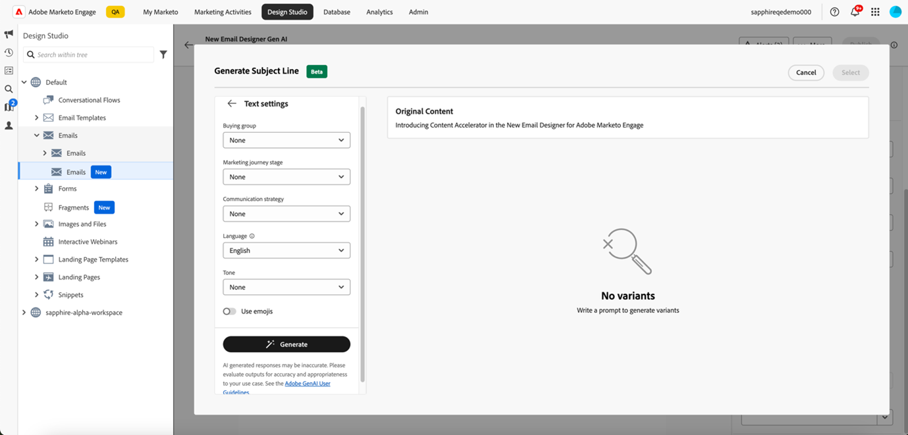
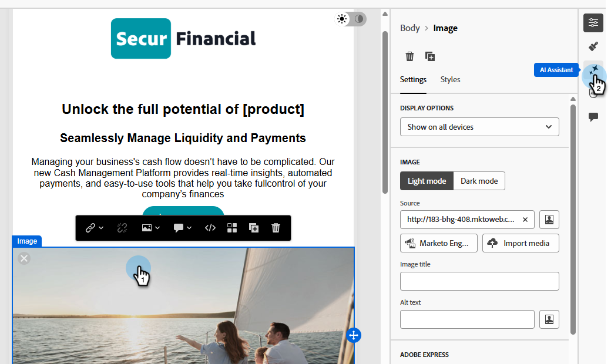
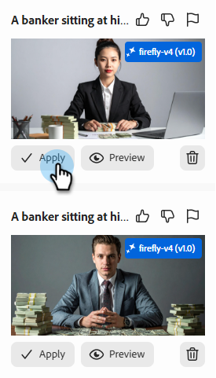

# AI Assistant för e-post i Designer {#ai-assistant-email-designer}

AI Assistant i Marketo Engage Email Designer hjälper dig att skapa aktuella, högpresterande och intuitiva e-postmeddelanden. Detta uppnås genom Adobe generativa AI-teknologi och ett bibliotek med Firefly för bildgenerering som hjälper till att skapa lämpligt innehåll för en viss individ/köpgrupp, marknadsföringssteg, kommunikationsstrategi, ton osv. Specifika varumärkesresurser kan också användas för att skapa innehåll.

>[!PREREQUISITES]
>
>AI-assistenten är inte aktiverad som standard. Du måste först godkänna villkoren för [Core Gen-AI och de kompletterande villkoren](https://www.adobe.com/legal/terms/enterprise-licensing/genai-ww.html){target="_blank"} för att kunna använda Gen-AI-funktionen i e-postprogrammet för Designer. Kontakta Adobe Account Team (din kontoansvarige) för mer information.

## Konfigurera behörigheter {#set-up-permissions}

_Efter_ som följer ovanstående krav måste Marketo-administratörer ge åtkomst till specifika användare/roller innan användarna kan se GenAI-knapparna.

+++Lär dig hur du ställer in behörigheter

1. I Marketo Engage klickar du på **Admin** och väljer **Användare och roller**.

   

1. Dubbelklicka på önskad roll på fliken **Roller**.

   

1. Under _Access Design Studio_ markerar du kryssrutan **Access AI Assistant** och klickar på **Spara**.

   

1. Klicka på fliken Användare och välj den användare som du vill ge åtkomst till.

   

1. Välj den roll du valde i steg 3 och den önskade arbetsytan (om tillämpligt). Klicka på **Spara**.

   

+++

## Användningsfall {#use-cases}

Det finns några primära användningsområden för AI Assistant:

* [Skapa en ämnesrad och/eller en preheader](#create-a-subject-line-preheader) för ditt e-postmeddelande
* [Skapa innehåll för ett visst avsnitt](#create-content-for-a-specific-section) i e-postmeddelandet
* [Skapa ett helt e-postmeddelande](#create-an-entire-email) från en markerad mall

## Skapa en ämnesrad/preheader {#create-a-subject-line-preheader}

Du kan använda AI-assistenten för att skapa en ämnesrad, en prerubrik eller båda.

Exemplet nedan visar ämnesraden. För en förrubrik kan du följa samma steg genom att klicka i kryssrutan _Förrubrik_ (visas i bilden ovan).

När ett e-postmeddelande skapas med Designer New Email anger du en tillfällig ämnesrad.

När e-postmeddelandet har skapats finns ämnesraden i kolumnen _Detaljer_ till höger. Klicka på AI-assistentknappen (  ) bredvid om du vill ha hjälp med att skapa en ny ämnesrad med Gen AI-funktionen.

Aktivera alternativet **Använd referensinnehåll** för AI Assistant för att anpassa nytt innehåll baserat på det valda innehållet.

Ange uppmaningen att anpassa ämnesraden. Ange relevanta textinställningar och överför alla varumärkesresurser som du vill använda som referens för att skapa en lämplig ämnesrad.

Textinställningarna omfattar:

<table><tbody>
  <tr>
    <td style="width:25%"><b>Buying Group</b></td>
    <td>Den specifika köpgrupp som ni riktar in er på (t.ex."Practitioner","Influencer","Decision Maker").</td>
  </tr>
  <tr>
    <td style="width:25%"><b>Marknadsföringsresa</b></td>
    <td>Mottagare i ett visst stadium av marknadsföringsresan (t.ex. Discover, Evaluate, Commit).</td>
  </tr>
  <tr>
    <td style="width:25%"><b>Kommunikationsstrategi</b></td>
    <td>Syftet med kommunikationen (t.ex. brådskande frågor, socialt bevis, information).</td>
  </tr>
  <tr>
    <td style="width:25%"><b>Språk</b></td>
    <td>Det språk som du vill att ämnesraden ska skapas på.</td>
  </tr>
  <tr>
    <td style="width:25%"><b>Ton</b></td>
    <td>Ton som du vill att innehållet ska genereras i (t.ex. Inspiration, Exciting, Humorous).</td>
  </tr>
  <tr>
    <td style="width:25%"><b>Emojis</b></td>
    <td>Gör att uttryckssymboler kan inkluderas i det genererade innehållet.</td>
  </tr>
</tbody>
</table>

När du klickar på **Generera** visas exempel som du kan välja bland:

Du kan också överföra en varumärkesresurs för att använda innehåll i resursen som referens för att skapa ämnesraden.

Om du vill välja en variant markerar du dess kryssruta och klickar på **Markera**. Du kan även ändra den genom att klicka på **Förfina**. Dessutom kan du ge feedback genom att klicka på reglagen uppåt eller nedåt så att Gen-AI-tekniken lär dig mer om dina önskemål.

När du har gjort ditt val fylls ämnesraden i i din e-postinformation.

## Skapa innehåll för ett visst avsnitt i e-postmeddelandet {#create-content-for-a-specific-section}

När e-postmeddelandet har skapats kan du ändra vissa avsnitt, bilder eller text.

I det här exemplet använder vi en finansiell mall. Om en eller flera av de befintliga bilderna inte uppfyller dina behov kan du instruera AI-assistenten att skapa en ny bild baserat på din beskrivning. Markera önskad bild och klicka på AI-assistentikonen.

Ange relevanta uppgifter i uppmaningen, t.ex.&quot;En bank som sitter vid sitt skrivbord med massor av kontanter&quot;. Du kan också använda promptbiblioteket (till höger om uppmaningen) om du inte är säker på vad du ska ange. Klicka på **Bildinställningar**.

Klicka på växlingsknappen för att aktivera _Generera bilder med AI_ och ändra sedan önskade inställningar, inklusive vilken modell som ska användas (Adobe Firefly eller Gemini 2.5 Nano Banana). När du är klar klickar du på **Generera**.

Flera varianter skapas. Välj din favorit och klicka på **Använd**.

>[!NOTE]
>
>Om ingen av bilderna uppfyller dina behov klickar du på **Generera** igen för att skapa nya versioner.

Textdelar av e-postmeddelandet kan också ändras på samma sätt som bilden.

## Skapa ett helt e-postmeddelande från en vald mall {#create-an-entire-email}

Det här alternativet är bara tillgängligt om e-postmeddelandet har skapats med en befintlig mall. Det kan vara en standardmall som tillhandahålls av e-post-Designer, en sparad mall som du redan har skapat eller en importerad mall som använder alternativet Importera HTML. Det här alternativet är inte tillgängligt om du väljer [Designa från grunden](/help/marketo/product-docs/email-marketing/email-designer/email-authoring.md#design-from-scratch) för ditt e-postmeddelande.

Välj en mall utan att markera någon komponent i mallen och klicka på AI-assistentknappen i e-postens Designer.

Ange den relevanta uppmaningen och välj textinställningar, varumärkesresurser och eventuella bildinställningar som du vill använda för e-postmeddelandet.

Om du vill generera bilder med Firefly väljer du Bildinställningar och väljer alternativet **Generera bilder med AI**.

Välj önskad _innehållstyp_, _färg och ton_, _ljus_ och _komposition_ för att skapa Gen-AI-bilder för e-postmeddelandet. Klicka på **Generera** när du är klar.

Se hur en variant kommer att se ut i ditt e-postmeddelande genom att klicka på **Förhandsgranska**. Välj en variation genom att klicka på **Använd**.
