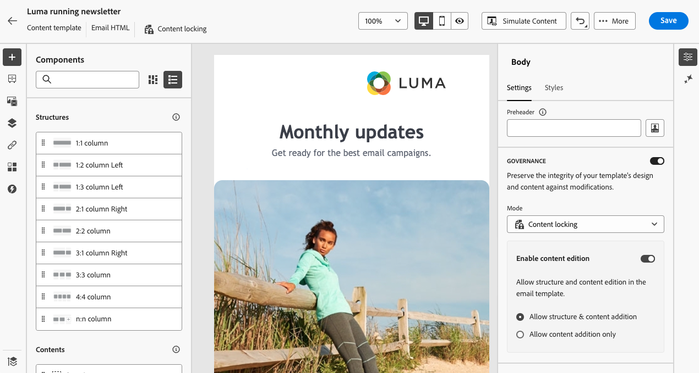
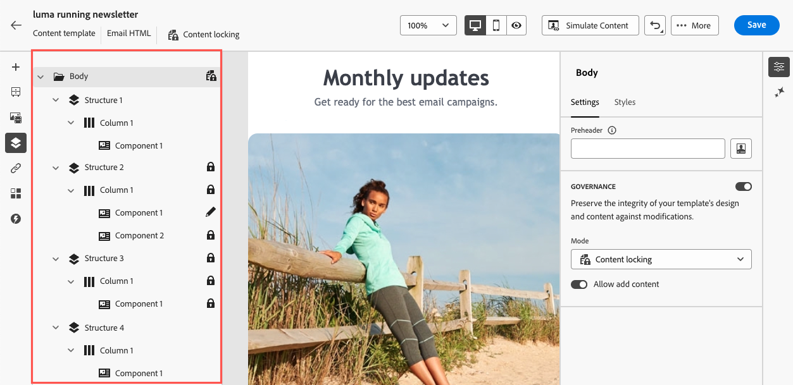

# Lås innehåll i e-postmallar {#lock-content-email-templates}

Med Marketo Engage kan du låsa innehåll i e-postmallar, antingen genom att låsa hela mallen eller specifika strukturer/komponenter. På så sätt kan ni förhindra oavsiktliga redigeringar och borttagningar, vilket ger er bättre kontroll över mallanpassning och förbättrar effektiviteten och tillförlitligheten i era e-postkampanjer.

>[!AVAILABILITY]
>
>Användare med behörighet att skapa innehållsmallar kan aktivera låsning av innehåll.

Innehållslås kan användas antingen på **strukturnivå** eller på **komponentnivå**.

* När en struktur är låst:

   * Allt innehåll i den strukturen är också låst.
   * Inget innehåll kan läggas till i strukturen.
   * Som standard kan du inte ta bort strukturen. Du kan åsidosätta den här begränsningen genom att aktivera alternativet&quot;Tillåt borttagning&quot;.
   * Enskilda innehållskomponenter i den låsta strukturen kan anges som redigerbara.

* När en struktur är redigerbar (strukturen är inte låst):

   * Enskilda innehållskomponenter kan låsas inuti den strukturen.
   * Som standard kan du inte ta bort en komponent om den är låst eller om&quot;Endast redigerbart innehållslås&quot; är markerat. Du kan åsidosätta den här begränsningen genom att aktivera alternativet&quot;Tillåt borttagning&quot;.

## Lås en e-postmall {#lock-an-email-template}

### Aktivera låsning av innehåll {#enable-content-locking}

Du kan aktivera innehållslås för en e-postmall direkt i e-postmallen Designer, oavsett om du skapar en ny mall eller redigerar en befintlig mall.

—STOPPAD REDIGERING HÄR—

1. Öppna eller skapa en e-postmall och gå till redigeringsskärmen i e-post-Designer.

1. Aktivera alternativet **[!UICONTROL Governance]** i rutan **[!UICONTROL Body]** till höger.

1. Välj önskat låsläge för mallen i listrutan **[!UICONTROL Mode]**:

   * **[!UICONTROL Content locking]**: Lås specifika innehållsavsnitt i mallen. Som standard går det att redigera alla strukturer och komponenter. Du kan sedan selektivt låsa enskilda element.
   * **[!UICONTROL Read only]**: Lås hela innehållet i mallen och förhindra ändringar.

   {width="800" zoomable="yes"}

1. Om du har valt läget **[!UICONTROL Content locking]** kan du ytterligare definiera hur användare kan interagera med mallen. Växla på alternativet **[!UICONTROL Enable content edition]** och välj något av följande:

   * **[!UICONTROL Allow structure & content addition]**: Användare kan lägga till strukturer mellan befintliga strukturer och lägga till innehållskomponenter eller fragment inom redigerbara strukturer.

   * **[!UICONTROL Allow content addition only]**: Användare kan lägga till innehållskomponenter eller fragment i redigerbara strukturer, men de kan inte lägga till eller duplicera strukturer.

1. När du har valt låsläget kan du definiera vilka strukturer och/eller komponenter som ska låsas om du har valt **[!UICONTROL Content locking]**-läget:

   * [Lär dig låsa strukturer](#lock-structures)
   * [Lär dig låsa komponenter](#lock-components)

   Om du väljer läget **[!UICONTROL Read only]** kan du fortsätta med att slutföra och spara mallen som vanligt.

Du kan justera inställningarna för **[!UICONTROL Governance]** när som helst när du designar mallen genom att välja mallbrödtexten. Det gör du genom att klicka på länken **[!UICONTROL Body]** i navigeringsfältet som finns högst upp på den högra panelen.

{width="800" zoomable="yes"}

### Lås strukturer {#lock-structures}

Så här låser du en struktur i mallen:

1. Välj den struktur som du vill låsa.

1. Välj **[!UICONTROL Locked]** i listrutan **[!UICONTROL Lock type]**.

   {width="800" zoomable="yes"}

   >[!NOTE]
   >
   >Som standard kan användare inte ta bort låsta strukturer. Du kan åsidosätta den här begränsningen genom att aktivera alternativet **[!UICONTROL Allow delete]**.

När du har låst en struktur kan inga ytterligare innehållskomponenter eller fragment dupliceras eller läggas till inuti den. Alla komponenter i en låst struktur är också låsta som standard. Så här gör du en komponent redigerbar i en låst struktur:

1. Markera den komponent som du vill låsa upp.

1. Växla på alternativet **[!UICONTROL Use specific locking]**.

1. Välj **[!UICONTROL Editable]** i listrutan **[!UICONTROL Lock type]**. Välj **[!UICONTROL Editable content only]** om du vill tillåta redigering av innehåll när du låser format. [Lär dig att låsa komponenter](#lock-components)

   {width="800" zoomable="yes"}

### Lås komponenter {#lock-components}

Så här låser du en specifik komponent i en struktur:

1. Markera komponenten och aktivera alternativet **[!UICONTROL Use specific locking]** i den högra rutan.

1. Välj önskat låsalternativ i listrutan **[!UICONTROL Lock type]**:

   {width="800" zoomable="yes"}

   * **[!UICONTROL Editable content lock only]**: Lås komponentens format men tillåter innehållsredigering.
   * **[!UICONTROL Locked]**: Lås både komponentens innehåll och format fullständigt.

   >[!NOTE]
   >
   >Låstypen **[!UICONTROL Editable]** gör att användare kan redigera en komponent, även i en låst struktur. [Lär dig att låsa strukturer](#lock-structures)

1. Som standard kan användare inte ta bort låsta komponenter. Du kan aktivera borttagning genom att aktivera alternativet **[!UICONTROL Allow delete]**.

### Identifiera låst innehåll {#identify-locked-content}

Använd **[!UICONTROL Navigation tree]** på den vänstra menyn för att enkelt identifiera låsta strukturer och komponenter i mallen. Den här menyn innehåller en visuell översikt över alla mallelement. Låsta objekt markeras med en låsikon och redigerbara objekt med en pennikon.

I exemplet nedan är styrning aktiverat för mallbrödtexten. *Struktur 2* är låst med *Komponent 1* redigerbar, medan *Struktur 3* är helt låst.

{width="800" zoomable="yes"}

## Använd mallar med låst innehåll {#use-templates-with-locked-content}

När du använder en mall med låst innehåll visas meddelandet **[!UICONTROL Governance enabled]** i den högra rutan.

Beroende på vilken typ av låsning som används för mallen kan du utföra olika åtgärder för mallens strukturer och komponenter. Om du snabbt vill identifiera alla redigerbara områden i mallen aktiverar du alternativet **[!UICONTROL Highlight editable areas]**.

I mallen nedan är till exempel alla områden redigerbara, förutom den översta bilden som har låsts, vilket innebär att du inte kan redigera eller ta bort den.

{width="800" zoomable="yes"}

Detaljerad information om olika typer av låsning som kan användas finns i följande avsnitt:

* [Lås strukturer](#lock-structures)
* [Lås komponenter](#lock-components)

Här är några exempel på e-postutgåvan och den tillhörande konfigurationen för låsning av innehåll som har konfigurerats:

<table>
<thead>
  <tr>
    <th>Typ av låsning av innehåll</th>
    <th>Mallkonfiguration</th>
    <th>E-postversion</th>
  </tr></thead>
<tbody>
  <tr>
    <td>Skrivskyddad innehållsmall</td>
    <td></td>
    <td></td>
  </tr>
  <tr>
    <td>Det går att redigera allt innehåll, men användarna kan inte lägga till någon struktur eller komponent</td>
    <td></td>
    <td></td>
  </tr>
  <tr>
    <td>Låst struktur som inte kan tas bort</td>
    <td></td>
    <td></td>
  </tr>
  <tr>
    <td>Komponent med låsta format som inte kan tas bort. Användarna kan bara ändra innehållet.</td>
    <td></td>
    <td></td>
  </tr>
  <tr>
    <td>Redigerbar komponent i en låst struktur.</td>
    <td></td>
    <td></td>
  </tr>
</tbody>
</table>
