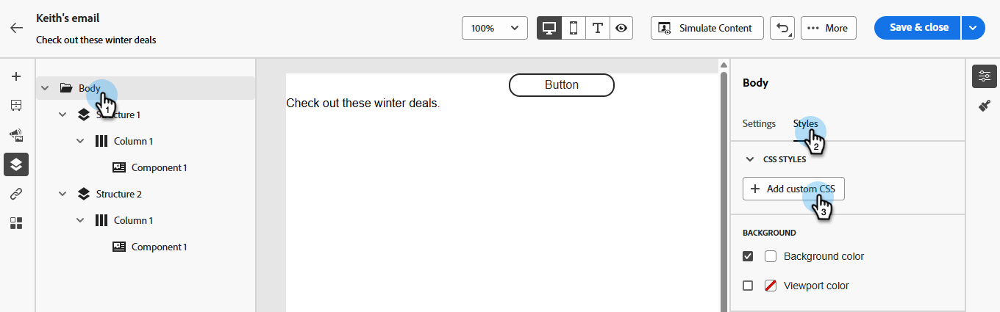

# Lägg till anpassad CSS i e-postinnehållet {#custom-css}

Lägg in egen CSS direkt i Marketo Engage Email Designer för avancerad, specifik formatering.

## Definiera anpassad CSS {#define-custom-css}

1. Se till att det finns visst innehåll definierat i e-post-Designer genom att lägga till minst en komponent.

1. Välj **[!UICONTROL Body]**, antingen från **[!UICONTROL Navigation tree]** till vänster eller från den högra rutan. **[!UICONTROL CSS styles]** visas till höger.

   {width="800" zoomable="yes"}

   >[!NOTE]
   >
   >Avsnittet **[!UICONTROL CSS styles]** är bara tillgängligt när det finns innehåll i redigeraren.

1. Klicka på knappen **[!UICONTROL + Add custom CSS]**.

   >[!NOTE]
   >
   >Knappen **[!UICONTROL Add custom CSS]** är bara tillgänglig när **[!UICONTROL Body]** är markerad. Du kan dock använda anpassade CSS-format på alla komponenter i innehållet.

1. Ange din CSS-kod i det dedikerade textområdet som visas. Kontrollera att den anpassade CSS-koden [ är giltig och följer rätt syntax ](#use-valid-css). Klicka på **Spara** när du är klar.

   

   >[!NOTE]
   >
   >Du kan inte lägga till anpassad CSS i ditt innehåll när du använder en [mall med låst innehåll](/help/marketo/product-docs/email-marketing/email-designer/content-locking.md). Knappetiketten ändras till **[!UICONTROL View custom CSS]** och all anpassad CSS som visas är skrivskyddad.

1. Kontrollera att CSS-koden gäller för ditt innehåll. Om så inte är fallet kontrollerar du avsnittet [Felsökning](#troubleshooting).

   

   >[!NOTE]
   >
   >Om du tar bort allt innehåll försvinner avsnittet och den tidigare definierade anpassade CSS används inte längre. Lägg till innehåll igen så att avsnittet **[!UICONTROL CSS styles]** visas igen. Den anpassade CSS-koden används igen.

## Använda giltig CSS {#using-valid-css}

Du kan ange valfri giltig CSS-sträng i textområdet **[!UICONTROL Add custom CSS]**. Formaterad CSS används omedelbart på innehållet.

>[!CAUTION]
>
>Du ansvarar för säkerheten för din anpassade CSS. Se till att CSS inte medför sårbarheter eller konflikter med det befintliga innehållet.
>
>Undvik att använda CSS som kan bryta innehållets layout eller funktion av misstag.

+++ Exempel på giltig CSS

Nedan finns exempel på giltig CSS.

```css
.acr-component[data-component-id="form"] {
  display: flex;
  justify-content: center;
  background: none;
}

.acr-Form {
  width: 100%;
  padding: 20px 100px;
  border-spacing: 0px 8px;
  box-sizing: border-box;
  margin: 0;
}

.acr-Form .spectrum-FieldLabel {
  width: 20%;
}

.acr-Form.spectrum-Form--labelsAbove .spectrum-FieldLabel,
.acr-Form [data-form-item="checkbox"] .spectrum-FieldLabel {
  width: auto;
}

.acr-Form .spectrum-Textfield {
  width: 100%;
}

#acr-form-error,
#acr-form-confirmation {
  width: 100%;
  padding: var(--spectrum-global-dimension-static-size-500);
  display: flex;
  align-items: center;
  flex-direction: column;
  justify-content: center;
  gap: var(--spectrum-global-dimension-static-size-200);
}

.spectrum-Form-item.is-required .spectrum-FieldLabel:after{
  content: '*';
  font-size: 1.25rem;
  margin-left: 5px;
  position: absolute;
}

/* Error field placeholder */
.spectrum-HelpText {
  display: none !important;
}

.spectrum-HelpText.is-invalid,
.is-invalid ~ .spectrum-HelpText {
  display: flex !important;
}
```

```css
@media only screen and (min-width: 600px) {
  .acr-paragraph-1 {
    width: 100% !important;
  }
}
```

+++


+++ Exempel på ogiltig CSS

Om ogiltig CSS anges visas ett felmeddelande som anger att CSS inte kan sparas. Nedan finns exempel på ogiltig CSS.

Användning av `<style>`-taggar accepteras inte:

```html
<style type="text/css">
  .acr-Form {
    width: 100%;
    padding: 20px 100px;
    border-spacing: 0px 8px;
    box-sizing: border-box;
    margin: 0;
  }
</style>
```

Ogiltig syntax, t.ex. saknade klammerparenteser, accepteras inte:

```css
body {
  background: red;
```

+++

## Tekniskt genomförande {#implementation}

Din anpassade CSS läggs till i slutet av avsnittet `<head>` som en del av en `<style>` -tagg med attributet `data-name="global-custom"`, som i exemplet nedan. Detta garanterar att de anpassade formaten tillämpas globalt på innehållet.

+++ Se exempel

```html
<!DOCTYPE html>
<html>
  <head>
    <meta charset="utf-8">
    <meta name="content-version" content="3.3.31">
    <meta name="x-apple-disable-message-reformatting">
    <meta name="viewport" content="width=device-width,initial-scale=1.0">
    <style data-name="default" type="text/css">
      td { padding: 0; }
      th { font-weight: normal; }
    </style>
    <style data-name="grid" type="text/css">
      .acr-grid-table { width: 100%; }
    </style>
    <style data-name="acr-theme" type="text/css" data-theme="default" data-variant="0">
      body { margin: 0; font-family: Arial; }
    </style>
    <style data-name="media-default-max-width-500px" type="text/css">
      @media screen and (max-width: 500px) {
        body { width: 100% !important; }
      }
    </style>
    <style data-name="global-custom" type="text/css">
      /* Add you custom CSS here */
    </style>
  </head>
  <body>
    <!-- Minimal content -->
  </body>
</html>
```

+++


Den anpassade CSS-koden tolkas eller valideras inte av e-postfönstret för Designer **[!UICONTROL Settings]**. Den är helt oberoende och kan bara ändras med alternativet **[!UICONTROL Add Custom CSS]**.

### Guardrails - importerat innehåll {#guardrails}

Om du vill använda anpassad CSS med innehåll som importerats till e-post-Designer bör du tänka på följande:

* Om du [importerar externt HTML](/help/marketo/product-docs/email-marketing/email-designer/email-authoring.md#import-html)-innehåll inklusive CSS, kommer det att finnas i **[!UICONTROL Compatibility mode]**, där **[!UICONTROL CSS styles]**-avsnittet inte är tillgängligt, om du inte konverterar det innehållet.

* Om du importerar innehåll som har skapats med e-post-Designer innehåller CSS som har tillämpats med alternativet **[!UICONTROL Add custom CSS]**, visas den CSS som tidigare har tillämpats och kan redigeras med samma alternativ.

## Felsökning {#troubleshooting}

Om din anpassade CSS inte används provar du med förslagen nedan.

* Kontrollera att CSS-koden är giltig och fri från syntaxfel (t.ex. saknade parenteser, felaktiga egenskapsnamn). [Lär dig hur](#use-valid-css)

* Kontrollera att din CSS läggs till i taggen `<style>` med attributet `data-name="global-custom"`.

* Kontrollera om stiltaggen `global-custom` har attributet `data-disabled` inställt på `true`. I så fall används inte den anpassade CSS:en.

+++ Exempel:

  ```html
  <style data-name="global-custom" type="text/css" data-disabled="true"> body: { color: red; } </style>
  ```

+++

* Kontrollera att CSS inte åsidosätts av andra CSS-regler.

   * Använd webbläsarens utvecklingsverktyg för att inspektera innehållet och verifiera att CSS har rätt väljare som mål.

   * Överväg att lägga till `!important` i dina deklarationer för att säkerställa att de har företräde.

+++ Exempel:

     ```css
     .acr-Form {
       background: red !important;
     }
     ```

+++

>[!NOTE]
>
>Marketo Engage Support har inte konfigurerats för att hjälpa till med felsökning av anpassad CSS. Kontakta en webbutvecklare om du behöver hjälp med CSS.
