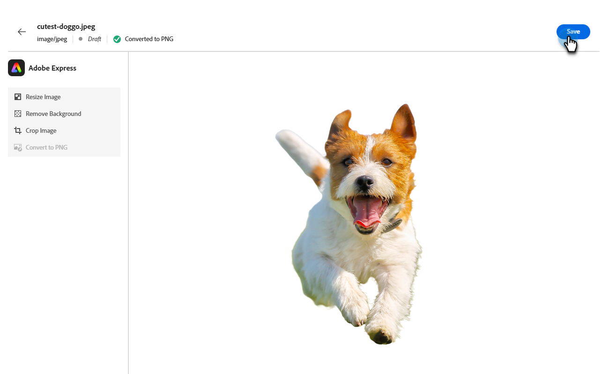

# Redigera bilder med Adobe Express {#edit-images-with-adobe-express}

Adobe Marketo Engage kan integreras med Adobe Express och ger tillgång till en mängd olika bildredigeringsverktyg. Du kan använda dessa verktyg för att ändra dina bilder i Marketo Engage Design Studio. Integreringen ger följande viktiga fördelar:

* Större återanvändning av innehåll genom att redigera och spara nya bilder i Marketo Engage.

* Mindre tid och arbete med att uppdatera bilder eller skapa nya versioner av befintliga bilder.

>[!NOTE]
>
>Adobe Express stöder för närvarande endast bildfilformaten PNG och JPEG.

## Öppna Adobe Express Editor {#access-the-adobe-express-editor}

Det finns två sätt att öppna Adobe Express-redigeraren:

* Klicka på bildens namn
* _Bild- och filåtgärder_-listruta

>[!BEGINTABS]

>[!TAB Klicka på bildnamnet]

1. I Marketo Engage går du till **[!UICONTROL Design Studio]** och väljer **[!UICONTROL Images and Files]**.

   {width="600" zoomable="yes"}

1. Markera den bild som du vill redigera.

   {width="600" zoomable="yes"}

   >[!NOTE]
   >
   >* Om du vill visa resurserna efter arbetsyta och mapp öppnar du strukturen genom att klicka på ikonen **[!UICONTROL Show Folders]** längst upp till vänster.
   >
   >* Om du vill sortera tabellen efter någon av kolumnerna klickar du på kolumnrubriken. Pilen i rubrikraden anger den aktuella sorteringskolumnen och -ordningen.

1. Klicka på **[!UICONTROL Edit in Adobe Express]** på fliken _Detaljer_ i bilden.

   {width="600" zoomable="yes"}

   >[!CAUTION]
   >
   >Om det redan finns referenser till bilden i en e-postmall eller e-postmall kommer eventuella ändringar att uppdatera bilden överallt där den används.

>[!TAB Bild- och filåtgärder]

1. I Marketo Engage går du till **[!UICONTROL Design Studio]** och väljer **[!UICONTROL Images and Files]**.

   {width="600" zoomable="yes"}

   >[!NOTE]
   >
   >* Om du vill visa resurserna efter arbetsyta och mapp öppnar du strukturen genom att klicka på ikonen **[!UICONTROL Show Folders]** längst upp till vänster.
   >
   >* Om du vill sortera tabellen efter någon av kolumnerna klickar du på kolumnrubriken. Pilen i rubrikraden anger den aktuella sorteringskolumnen och -ordningen.

1. Markera kryssrutan bredvid bilden som du vill redigera. Välj **[!UICONTROL Edit in Adobe Express]** i listrutan **[!UICONTROL Image and file actions]**.

   {width="600" zoomable="yes"}

   >[!CAUTION]
   >
   >Om det redan finns referenser till bilden i en e-postmall eller e-postmall kommer eventuella ändringar att uppdatera bilden överallt där den används.

>[!ENDTABS]

## Adobe Express Enterprise-licens {#adobe-express-enterprise-license}

### Användare med en Enterprise-licens {#users-with-an-enterprise-license}

Om du har en Enterprise-licens för Adobe Express har du tillgång till den fullständiga Express-redigeraren. Du kan justera bildinställningar som färg, intensitet, skärpa, kontrast, storlek och mycket mer. Med alternativet AI Magic kan du ta bort bakgrunder, infoga och ta bort objekt samt radera delar av en bild. Gå till [Adobe Express användarhandbok](https://helpx.adobe.com/express/user-guide.html){target="_blank"} om du vill veta mer om de olika inställningarna.

>[!IMPORTANT]
>
>Den köpta licensen måste vara under samma IMS-organisation som din Marketo Engage-prenumeration för att få tillgång till alla redigeringsmöjligheter i Adobe Express. Varje enskild användare måste dessutom ha en licens i Adobe Express. Användare [utan licens](#users-without-an-enterprise-license) har bara åtkomst till snabbåtgärderna i Adobe Express.

### Användare utan Enterprise-licens {#users-without-an-enterprise-license}

För dem som saknar Enterprise-licens har du fortfarande tillgång till flera snabbredigeringsfunktioner. De här funktionerna är:

* [Ändra bildstorlek](#resize-image)
* [Ta bort bakgrund](#remove-background)
* [Beskär bild](#crop-image)
* [Konvertera till PNG/JPEG](#convert-to-png-jpeg)

Funktionerna är tillgängliga till vänster på bildsidan.

{width="800" zoomable="yes"}

#### Ändra bildstorlek {#resize-image}

1. Klicka på **Ändra storlek på bild**.

1. Gör önskade ändringar och klicka på **Använd** när du är klar.

{width="800" zoomable="yes"}

<table><tbody>
  <tr>
    <td style="width:25%"><b>Proportioner</b></td>
    <td>I listrutan <b>Proportioner</b> väljer du <b>Standard</b> om du vill välja bland förberäknade vanliga fotostorlekar eller <b>Anpassad</b> om du vill ange en egen bredd/höjd. Du kan också välja standardstorlek för en viss plattform för sociala medier (Pinterest, Snapchat osv.).</td>
  </tr>
  <tr>
    <td style="width:25%"><b>Bredd och höjd</b></td>
    <td>Som standard är proportionerna låsta och bildens proportioner ändras inte när du ändrar storleken. Om du vill kan du välja låsknappen för att låsa upp proportionerna.</td>
  </tr>
  <tr>
    <td style="width:25%"><b>Återställ</b></td>
    <td>Klicka på <b>Återställ</b> om du vill ta bort ändringar som gjorts i bilden och återställa den till det ursprungliga läget.</td>
  </tr>
  <tr>
    <td style="width:25%"><b>Zooma och beskära</b></td>
    <td>Klicka på <b>Zooma och beskär</b> om du vill zooma in på specifika delar av bilden. Om du klickar på <b>Använd</b> efter att du har zoomat beskärs bilden till det som för närvarande visas.</td>
  </tr>
</tbody>
</table>

#### Ta bort bakgrund {#remove-background}

1. Klicka på **Ta bort bakgrund**.

1. Adobe Express visar bilden utan bakgrund. Om det passar dina behov klickar du på **Använd**.

{width="800" zoomable="yes"}

>[!TIP]
>
>Om du inte är nöjd med resultatet klickar du bara på **X** för att stänga fönstret.

#### Beskär bild {#crop-image}

1. Klicka på **[!UICONTROL Crop Image]**.

1. Dra hörnen på bilden för att skapa den beskärning du vill använda.

{width="800" zoomable="yes"}

1. Klicka på **[!UICONTROL Apply]** när du är klar.

#### Konvertera till PNG/JPEG {#convert-to-png-jpeg}

Konvertera en PNG-fil till en JPEG-fil eller en JPEG-fil till en PNG-fil.

1. Klicka på **[!UICONTROL Convert to PNG/JPEG]**.

{width="800" zoomable="yes"}

1. Klicka på **[!UICONTROL Apply]**.

## Spara ditt arbete {#save-your-work}

När du är klar med alla redigeringar klickar du på **Spara** för att spara ditt arbete.

{width="800" zoomable="yes"}

Den redigerade bilden sparas i samma mapp som originalbilden.
