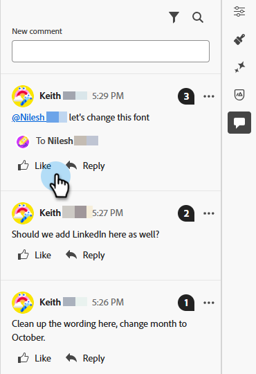

# E-postsamarbete {#email-collaboration}

Med e-postsamarbete och kommentering kan marknadsföringsteam smidigt granska, diskutera och färdigställa e-postresurser i Adobe Marketo Engage Email Designer. I stället för att dela utkast över externa verktyg (som chatt, e-posttrådar, kalkylblad etc.) kan du kommentera, föreslå ändringar och åtgärda feedback i realtid. Detta effektiviserar arbetsflödet, minskar antalet fel och säkerställer att alla intressenter är uppdaterade innan en e-postkampanj skickas.

## Behörigheter {#permissions}

Användare som har redigeringsbehörighet för en e-postresurs kan kommentera, tagga och visa kommentarer. Användare med skrivskyddad behörighet för e-postresurser kan **inte** lägga till eller visa kommentarer.

## Lägg till kommentarer {#add-comments}

1. När du skapar eller redigerar ett e-postmeddelande i e-postprogrammet klickar du på en struktur, en kolumn eller ett innehåll (text, bild, knapp osv.) över ett redigerbart avsnitt.

   

1. Klicka på kommentarsikonen.

   

1. Skriv feedback, frågor eller förslag.

   

>[!NOTE]
>
>Tagga lagkamrater med @mentions (t.ex. &quot;@John, uppdatera Winter Newsletter&quot;).

## Visa alla kommentarer {#view-all-comments}

1. Klicka på ikonen _Collaboration_ till höger.

   

1. Svara snabbt på eller gilla en kommentar.

   

1. Klicka på ikonen **..** om du vill se fler åtgärder.

   

## Lös kommentarer {#resolve-comments}

Varje kommentarstråd innehåller:

* Svar: Fortsätt diskussionen
* Lös: Markera kommentaren som löst
* Lös upp: Om fler redigeringar behövs
* Ta bort: Tar bort kommentaren från dess designelement
* Ta bort: Tar bort kommentaren permanent

>[!NOTE]
>
>Lösta trådar är dolda som standard, men du kan ändra dem genom att markera önskad tråd i filtret.

## Meddelanden {#notifications}

Teammedlemmar som är taggade får meddelanden via e-post och/eller pulsmeddelanden.

Meddelanden utlöses för:

* Nya kommentarer
* Meningar (@username)
* Lösningar

## Bästa praxis {#best-practices}

* Använd @mentions för att säkerställa att feedback snabbt når rätt teammedlem.

* Gruppera relaterad feedback i en enda kommentarstråd i stället för i flera utspridda anteckningar.

* Lös alltid kommentarer när de är adresserade för att upprätthålla ett rent arbetsflöde.

* Spara en färdig godkänd version för regelefterlevnad/revision.
