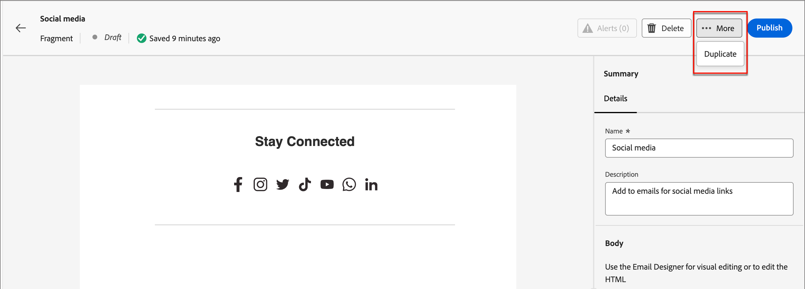

# Fragment

Ett fragment är en återanvändbar komponent som kan refereras i ett eller flera e-postmallar och e-postmallar. Det är vanligtvis ett innehållsblock (text, bild eller båda) som snabbt kan infogas i projektet. Med den här funktionen kan du skapa flera anpassade innehållsblock i förväg för att sammanställa e-postinnehåll för en förbättrad designprocess. Vanliga användningsområden är t.ex. innehållsblock för sidhuvud/sidfot för e-post, banners för inbjudningar till evenemang, säsongsmeddelanden med mera.

>[!NOTE]
>
>Fragment motsvarar [Fragment](/help/marketo/product-docs/personalization/segmentation-and-snippets/snippets/create-a-snippet.md){target="_blank"} i den gamla e-postredigeraren.

Så här använder du fragment på bästa sätt i dina arbetsflöden:

* _Skapa fragment_ - Skapa visuella fragment, antingen från grunden eller genom att spara innehåll som ett fragment från den visuella innehållsredigeraren.
* _Återanvänd fragment_ - Använd dem så många gånger som behövs i ditt innehåll.

## Visuella fragment {#visual-fragments}

Visuella fragment är fördefinierade visuella block som byggts (med den visuella innehållsredigeraren) och som du kan återanvända i flera e-postmallar eller e-postmallar.

## Få åtkomst till och hantera fragment {#access-and-manage-fragments}

Gå till **Design Studio** i Marketo Engage för att få åtkomst till visuella fragment. Klicka på **[!UICONTROL Fragments (New)]** i trädet till vänster.

{width="600" zoomable="yes"}

Som standard sorteras tabellen efter kolumnen _[!UICONTROL Modified]_. Klicka på andra kolumnrubriker om du vill ändra vad tabellen sorteras efter. Klicka på samma titel igen för att växla mellan stigande och fallande.

### Söka och filtrera

Använd sökfältet för att hitta ett fragment efter namn. Klicka på ikonen _Filter_ (  ) för att visa tillgängliga filteralternativ och välja önskade inställningar.

{width="700" zoomable="yes"}

### Anpassa kolumnerna {#customize-the-column-display}

Anpassa de kolumner som du vill visa i tabellen genom att klicka på ikonen _Anpassa tabell_ (  ) längst upp till höger.

Markera de kolumner som du vill ha och klicka på **[!UICONTROL Apply]**.

{width="400" zoomable="yes"}

### Fragmentstatus {#fragment-status}

Fragmentstatusen avgör om den är tillgänglig för användning i en e-post- eller e-postmall och vilka ändringar du kan göra i den.

<table>
<tbody>
  <tr>
    <td width="25%"><b>Utkast</b></td>
    <td width="75%">När du skapar ett fragment är det i utkaststatus. Det förblir ett utkast tills du publicerar det för användning i en e-postmall eller e-postmall.
    
Tillgängliga åtgärder:
    <li>Redigera all information</li>
    <li>Redigera i visuell designer</li>
    <li>Publicera</li>
    <li>Duplicera</li>
    <li>Ta bort</li>
  </td>
  <tr>
    <td><b>Publicerad</b></td>
    <td>När du publicerar ett fragment blir det tillgängligt för användning i en e-postmall eller e-postmall. Publicerat fragmentinnehåll kan inte ändras i den visuella designern.
    
Tillgängliga åtgärder:
    <li>Redigera beskrivning</li>
    <li>Lägg till i ett e-postmeddelande eller en mall</li>
    <li>Skapa utkastversion</li>
    <li>Duplicera</li>
    <li>Radera (om den inte används)</li>
    </td>
  </tr>
  <tr>
    <td style="width:25%"><b>Publicerat med utkast</b></td>
    <td style="width:75%">När du skapar ett utkast från ett publicerat fragment förblir den publicerade versionen tillgänglig för användning i en e-postmall eller e-postmall, och utkastinnehållet kan ändras i den visuella designern. Om du publicerar utkastet till version ersätter det den aktuella publicerade versionen och innehållet uppdateras i <i>alla</i> e-postmallarna och e-postmallarna som det används i.
    
Tillgängliga åtgärder:
    <li>Redigera beskrivning</li>
    <li>Lägg till i ett e-postmeddelande eller en mall</li>
    <li>Redigera utkast i visuell designer</li>
    <li>Publicera utkast</li>
    <li>Duplicera</li>
    <li>Radera (om den inte används)</li>
    </td>
  </tr>
</tbody>
</table>

## Skapa ett fragment {#create-a-fragment}

1. Om du vill skapa ett nytt visuellt fragment klickar du på **[!UICONTROL Create fragment]** längst upp till höger på fragmentlistsidan.

   {width="700" zoomable="yes"}

1. Ge ditt fragment en **[!UICONTROL Name]** och en **[!UICONTROL Description]** som tillval.

   _Fragmentkrav_

   * Namn: Högst 100 tecken, måste vara unikt, inte skiftlägeskänsligt
   * Beskrivning: Högst 300 tecken
   * Tecken: bokstäver, siffror och specialtecken är ok
   * Reserverade tecken är **_inte tillåtna_**: `\ / : * ? " < > |`

   {width="400" zoomable="yes"}

1. Klicka på **[!UICONTROL Create]**.

   {width="400" zoomable="yes"}

   >[!NOTE]
   >
   >Det går inte att ändra **typen** för ett fragment just nu.

1. En _Skapa din e-postadress_ visas. Välj _Använd teman_ eller _Manuell formatering_. I det här alternativet väljer vi **Använd teman**. Klicka på **Bekräfta** när du är klar.

   

   >[!NOTE]
   >
   >Om du väljer Manuell formatering använder du [designverktygen för innehåll](/help/marketo/product-docs/email-marketing/email-designer/email-authoring.md#add-structure-and-content){target="_blank"} för att skapa det visuella fragmentinnehållet.

1. Klicka på ikonen _Teman_ .

   

   >[!INFO]
   >
   >Läs mer om [temainställningar](/help/marketo/product-docs/email-marketing/email-designer/brand-themes.md#settings){target="_blank"}.

1. Klicka på **[!UICONTROL Save]** när du vill spara utkastet.

1. När du är redo att göra fragmentet tillgängligt för användning i en e-post- eller e-postmall klickar du på **[!UICONTROL Publish]**.

## Visa fragmentinformation {#view-fragment-details}

Klicka på namnet på ett fragment på listsidan för att öppna fragmentinformationssidan. Du kan välja att redigera fragmentet, byta namn på det eller uppdatera dess beskrivning. Gör uppdateringar och klicka utanför namnfältet eller beskrivningsfältet för att spara ändringarna.

>[!NOTE]
>
>Om ett publicerat fragment används av en e-post- eller e-postmall kan du inte ändra dess namn eller redigera innehållet. Du kan skapa ett utkast om du vill göra ändringar i fragmentet.

{width="600" zoomable="yes"}

Klicka på **[!UICONTROL Edit fragment]** för att öppna fragmentet i den visuella innehållsredigeraren.

Avsluta vyn när som helst genom att klicka på pilen _Bakåt_ längst upp till vänster, som återgår till listsidan _Fragment_ .

## Visa fragment som används av referenser {#view-fragment-used-by-references}

Klicka på fliken **[!UICONTROL Used By]** på sidan med fragmentinformation för att visa information om var fragmentet används i Marketo Engage.

>[!IMPORTANT]
>
>Ett fragment som används av en e-post- eller e-postmall kan inte tas bort.

{width="600" zoomable="yes"}

Klicka på länken för att öppna motsvarande e-post- eller e-postmall där fragmentet används.

## Ta bort fragment {#delete-fragments}

Eftersom ett fragment som för närvarande används av en e-post- eller e-postmall inte kan tas bort bör du kontrollera _som används av_-referenserna innan du påbörjar en fragmentborttagning. En borttagning kan inte ångras, så kontrollera innan du startar en borttagningsåtgärd.

Du kan ta bort ett fragment på något av följande sätt:

* Klicka på **[!UICONTROL Delete]** från fragmentinformationen till höger.
* Klicka på ellipsen bredvid fragmentet på listsidan _[!UICONTROL Fragments]_och välj **[!UICONTROL Delete]**.

Åtgärden öppnar en bekräftelsedialogruta. Du kan avbryta processen genom att klicka på **[!UICONTROL Cancel]** eller klicka på **[!UICONTROL Delete]** för att bekräfta borttagningen.

{width="400"}

## Redigera fragment {#edit-fragments}

Ändringar i ett fragment beror på dess aktuella status:

* När ett fragment har statusen _Utkast_ kan du redigera alla dess detaljer och det visuella innehållet.
* När ett fragment har statusen _Publicerad_ kan du redigera fragmentbeskrivningen, men inte namnet. Du kan inte redigera det visuella innehållet.
* När ett fragment har statusen _Publicerat med utkast_ begränsas redigeringen till beskrivningen. Du kan också redigera det visuella innehållet för utkastversionen.

>[!BEGINTABS]

>[!TAB Utkast]

1. Klicka på fragmentnamnet på listsidan _[!UICONTROL Fragments]_för att öppna det.

   En förhandsgranskning av det visuella innehållet visas, med fragmentinformationen till höger.

1. Gör önskade redigeringar.

   {width="600" zoomable="yes"}

1. Om du vill ändra innehållet i den visuella designern klickar du på **[!UICONTROL Edit fragment]**. Klicka på **Spara** när du är klar.

1. Klicka på **[!UICONTROL Save]** eller **[!UICONTROL Save & close]** för att återgå till fragmentinformationen.

1. När du vill göra fragmentet tillgängligt för användning i en e-post- eller e-postmall klickar du på **[!UICONTROL Publish]**.

>[!TAB Publicerad]

1. Klicka på fragmentnamnet på listsidan _[!UICONTROL Fragments]_för att öppna det.

   En förhandsgranskning av det visuella innehållet visas, med fragmentinformationen till höger.

1. Ändra beskrivningen om det behövs.

   För ett publicerat fragment går det inte att ändra all annan information.

1. Om du vill uppdatera innehållet klickar du på **[!UICONTROL Create draft version]** längst upp till höger.

   Klicka på **[!UICONTROL OK]** i dialogrutan för att öppna utkastet i den visuella designern. Du kan ändra `image source` KG - LÄNK HÄR om det behövs.

   {width="300"}

1. Klicka på **[!UICONTROL Save]** eller **[!UICONTROL Save & close]** för att återgå till fragmentinformationen.

1. När du vill göra fragmentet tillgängligt för användning i en e-post- eller e-postmall klickar du på **[!UICONTROL Publish]**.

>[!NOTE]
>
>När du publicerar utkastet ersätts den aktuella publicerade versionen och innehållet uppdateras i e-postmallarna och i e-postmallarna där det redan används.

>[!TAB Publicerat med utkast]

Det finns två sätt att öppna utkastet för redigering från listsidan _[!UICONTROL Fragments]_:

* Klicka på ikonen _Mer_ (**..**) bredvid fragmentnamnet och välj **[!UICONTROL Open draft version]**.

  {width="300"}

* Klicka på fragmentnamnet för att öppna det. Klicka sedan på **[!UICONTROL Open draft version]** överst till höger.

En förhandsgranskning av det visuella innehållet för utkastversionen visas, med fragmentinformationen till höger.

Så här uppdaterar du innehållet:

1. Klicka på **[!UICONTROL Edit fragment]** överst till höger. Klicka på **Spara** när du är klar.

1. Klicka på **[!UICONTROL Save]** eller **[!UICONTROL Save & close]** för att återgå till fragmentinformationen.

1. När du vill göra fragmentet tillgängligt för användning i en e-post- eller e-postmall klickar du på **[!UICONTROL Publish]**.

>[!NOTE]
>
>När du publicerar utkastet ersätts den aktuella publicerade versionen och innehållet uppdateras i e-postmallarna och i e-postmallarna där det redan används.

>[!ENDTABS]

## Duplicera fragment {#duplicate-fragments}

Du kan duplicera ett fragment på något av följande sätt:

* Klicka på ikonen _[!UICONTROL Fragments]_Mer_ (_..**) bredvid fragmentnamnet på listsidan**och välj **[!UICONTROL Duplicate]**.
* Klicka på **[!UICONTROL ... More]** längst upp till höger på sidan med fragmentinformation och välj **[!UICONTROL Duplicate]**.

{width="600" zoomable="yes"}

Ange ett unikt namn och en valfri beskrivning i dialogrutan. Klicka på **[!UICONTROL Duplicate]**.

{width="400"}

Det duplicerade fragmentet visas sedan i listan _Fragment_.

## Spara ett nytt fragment från e-post eller mallinnehåll {#save-a-new-fragment-from-email-or-template-content}

När du skapar/redigerar en e-postmall eller e-postmall i den visuella innehållredigeraren kan du spara hela eller delar av innehållet som ett fragment och återanvända det.

1. Om du vill spara innehåll som ett fragment klickar du på **[!UICONTROL More]** och väljer **[!UICONTROL Save as Fragment]**.

1. Markera de olika element som ska inkluderas i fragmentet.

   Markera flera strukturer genom att hålla ned Skift eller Ctrl.

   Du kan bara markera strukturer som ligger intill varandra.

1. Markera innehållet och klicka på **[!UICONTROL Create]** överst till höger.

1. Ange ett namn och en valfri beskrivning för fragmentet i dialogrutan och klicka på **[!UICONTROL Create]**.

Fragmentet visas sedan på listsidan _Fragment_ och kan användas i e-postmeddelanden och e-postmallar.

## Lägga till visuella fragment i e-post- eller mallinnehåll {#add-visual-fragments-to-your-email-or-template-content}

Fragment är utformade för återanvändning. Du kan lägga till upp till 30 i en e-postmall eller e-postmall, och de kan bara kapslas upp till en nivå.

* [Lägga till ett fragment i ett e-postmeddelande](/help/marketo/product-docs/email-marketing/email-designer/email-authoring.md#add-fragments)

* [Lägga till ett fragment i en e-postmall](/help/marketo/product-docs/email-marketing/email-designer/email-template-authoring.md#add-fragments)

Fragmentets innehåll uppdateras dynamiskt i strukturen för att återge hur innehållet visas i e-postmeddelandet.

>[!TIP]
>
>Om du vill att fragmentet ska uppta hela den vågräta layouten i e-postmeddelandet lägger du till en [!UICONTROL 1:1 kolumn ]-struktur och drar och släpper fragmentet i den.

När e-post-/e-postmallen har sparats visas den på fragmentinformationssidan när fliken _[!UICONTROL Used By]_har valts. Tillagda fragment kan inte redigeras i e-postmeddelandet eller mallen. Det publicerade källfragmentet definierar innehållet.

## Fragmentåtgärder vid e-post- och mallutveckling {#fragment-actions-during-email-and-template-authoring}

När ett fragment läggs till i en e-postmall eller e-postmall kan dess innehåll inte redigeras i e-postmeddelandet eller mallen. Du kan dock använda följande åtgärder:

* **[!UICONTROL Delete]** - Detta tar bort fragmentet från det aktuella e-post- eller e-postmallinnehållet (fragmentkällan påverkas inte).
* **[!UICONTROL Refresh]** - Detta uppdaterar innehållet i fragmentet i den aktuella e-post- eller e-postmallen. Det är praktiskt att uppdatera när du vill spegla de senaste ändringarna i fragmentet efter att ha lagt till e-post- eller e-postmallen.
* **[!UICONTROL Duplicate]** - Detta duplicerar fragmentet i samma e-postadress eller e-postmall i redigeraren. Det duplicerade fragmentet läggs till precis nedanför originalet.
* **[!UICONTROL Open Fragment]** - Då öppnas en ny webbläsarflik med fragmentredigeringssidan och information.
* **[!UICONTROL Break inheritance]** - Detta bryter arvet av fragmentet (och dess ändringar) från källan. Använd den här åtgärden om du vill göra fragmentinnehållet tillgängligt som oberoende och redigerbart innehåll i e-post- eller e-postmallen. Den här åtgärden tar också bort e-post- eller e-postmallen från referensen _Används av_ för det ursprungliga fragmentet.

När du markerar fragmentet på redigeringssidan är de här åtgärderna tillgängliga från kontextverktygsfältet och egenskapspanelen till höger.

{width="600" zoomable="yes"}

>[!MORELIKETHIS]
>
>[Anpassningsbara fragment](/help/marketo/product-docs/email-marketing/email-designer/customizable-fragments.md)
