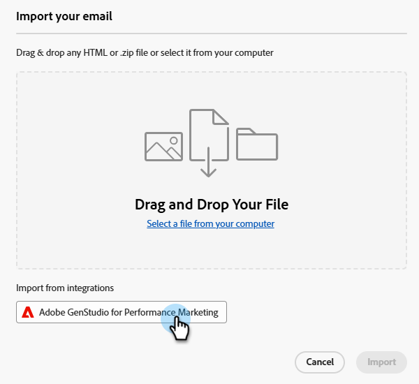

# GenStudio Integration för Marketo Engage {#genstudio-integration-for-marketo-engage}

Adobe GenStudio for Performance Marketing är en generativ AI-first-applikation där ni kan skapa egna annonser och e-postmeddelanden för att skapa slagkraftiga, personaliserade marknadsföringskampanjer som uppfyller era varumärkesstandarder och följer företagets policy. Det innehåller en mängd verktyg som förenklar komplexa innehållsskapande.

>[!INFO]
>
>Läs mer om [GenStudio for Performance Marketing](https://experienceleague.adobe.com/en/docs/genstudio-for-performance-marketing/user-guide/home){target="_blank"}.

## Utnyttja GenStudio Capabilities i Marketo Engage {#leverage-genstudio-capabilities}

Tack vare den här integreringen kan en teknisk marknadsförare som använder Marketo Engage för att utveckla och automatisera e-postkampanjer samarbeta med en resultatmarknadsförare som skapar innehåll med GenStudio. På så sätt kan de enkelt integrera varumärkesinnehåll från GenStudio i Marketo Engage.

## Exportera en HTML-mall från Marketo Engage till GenStudio {#export-an-html-template}

Exportera enkelt en mall som innehåller varumärkesriktlinjerna till GenStudio for Performance Marketing.

1. I Marketo Engage får du tillgång till innehållet i din e-post.

1. Klicka på knappen **Mer** i Designer för e-post och välj **Exportera HTML**.

   

1. [Överför den exporterade HTML](https://experienceleague.adobe.com/en/docs/genstudio-for-performance-marketing/user-guide/content/templates/use-templates#templates-from-ajo-and-marketo){target="_blank"}-mallen till GenStudio for Performance Marketing.

1. I GenStudio använder du den här mallen för att [skapa flera e-postvarianter](https://experienceleague.adobe.com/en/docs/genstudio-for-performance-marketing/user-guide/create/create-email-experience){target="_blank"} med AI-uppmaningar och spara dem.

## Utnyttja GenStudio Experience i Marketo Engage {#leverage-genstudio-experiences}

Följ stegen nedan för att utnyttja de e-postvarianter från GenStudio som du har skapat genom att importera dem till Marketo Engage.

1. I Marketo Engage [skapar du ett e-postmeddelande](/help/marketo/product-docs/email-marketing/email-designer/email-authoring.md#create-an-email).

1. Klicka på **Redigera e-postinnehåll** på sidan E-postinformation.

   

1. Välj **Importera HTML**.

   

1. Klicka på knappen **Adobe GenStudio for Performance Marketing**.

   

1. Bläddra bland GenStudio upplevelser för att börja bygga ditt innehåll. Ni kan filtrera upplevelserna utifrån kriterier som produkter, personer, varumärken eller till och med färger.

1. Välj en upplevelse och klicka på **Använd**.

   {width="800" zoomable="yes"}

1. Det markerade innehållet visas i e-post-Designer.

   {width="800" zoomable="yes"}

>[!NOTE]
>
>GenStudio-upplevelser som skapats från en Marketo Engage-mall importeras direkt till e-postDesigner. GenStudio-upplevelser som skapats utan en Marketo Engage-mall importeras i kompatibilitetsläge.

Använd [redigeringsverktygen för e-postinnehåll](/help/marketo/product-docs/email-marketing/email-designer/email-authoring.md#add-structure-and-content){target="_blank"} och [anpassningsfälten](/help/marketo/product-docs/email-marketing/email-designer/email-authoring.md#personalize-content){target="_blank"} för att redigera e-postmeddelandet efter behov.
