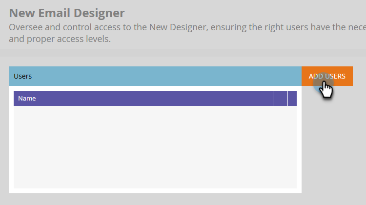

# E-posta Designer - översikt {#overview}

Välkommen till nya Adobe Marketo Engage Email Designer.

Designer för e-post är den senaste innovationen i Marketo Engage som är avsedd att ge en förbättrad upplevelse när det gäller att skapa e-postmallar och e-postmallar, vilket förbättrar produktiviteten och effektiviteten genom att tillhandahålla en visuell dra-och-släpp-redigerare tillsammans med färdiga standardmallar. Skapa enkelt anpassade e-postmallar utan att behöva spendera pengar på leverantörer.

## Åtkomst {#how-to-access}

+++Lär dig hur du får tillgång till e-postprogrammet Designer

Din Marketo Engage-prenumeration måste migreras till [Adobe Identity Management System (IMS)](https://experienceleague.adobe.com/sv/docs/marketo/using/product-docs/administration/marketo-with-adobe-identity/adobe-identity-management-overview) för att du ska kunna komma åt den nya e-postversionen av Designer. Om du inte har gjort det än och vill begära att det ska gå fort kontaktar du Adobe Account Team (din kontoansvarige) eller [Marketo Support](https://nation.marketo.com/t5/support/ct-p/Support).

### Lägg till användare {#add-users}

1. Gå till området **[!UICONTROL Admin]** i Marketo Engage och välj **[!UICONTROL New Email Designer]**.

   {width="600" zoomable="yes"}

1. Klicka på **[!UICONTROL Add Users]**.

   {width="600" zoomable="yes"}

1. Välj önskade användare i listrutan **[!UICONTROL Add New Values]**. Klicka på **[!UICONTROL OK]** när du är klar.

   {width="600" zoomable="yes"}

+++

## Populära artiklar {#popular-articles}

### Komma igång {#getting-started}

* [Skapa e-post](/help/marketo/product-docs/email-marketing/email-designer/email-authoring.md){target="_blank"}: Lär dig hur du skapar, utformar och refererar till ett e-postmeddelande i den nya redigeraren.

* [Framtagning av e-postmallar](/help/marketo/product-docs/email-marketing/email-designer/email-template-authoring.md){target="_blank"}: Lär dig hur du skapar, utformar och kommer åt en e-postmall i den nya redigeraren.

* [Fragment](/help/marketo/product-docs/email-marketing/email-designer/fragments.md){target="_blank"}: Lär dig hur du skapar och använder visuella innehållsfragment som återanvändbara komponenter för e-post och e-postmallar.

### Nya funktioner {#new-features}

* [Konverterare för bild till HTML](/help/marketo/product-docs/email-marketing/email-designer/feature-comparison.md){target="_blank"}: Överför en kompatibel PNG/JPEG-bildfil från ett e-postmeddelande och den konverteras automatiskt till HTML för användning i det nya e-postDesigner.

* [Varumärkesteman](/help/marketo/product-docs/email-marketing/email-designer/brand-themes.md){target="_blank"}: Definiera varumärkesteman i Marketo Engage. Formatkonfigurationer kan återanvändas och användas i alla e-postmallar och andra e-postresurser för enhetlig varumärkesexponering.

* [Mallimporterare](/help/marketo/product-docs/email-marketing/email-designer/import-template.md){target="_blank"}: Importera e-postmallar från den klassiska e-postredigeraren för att skapa mallar som är kompatibla med nya e-post-Designer i Design Studio.

* [Villkorligt innehåll](/help/marketo/product-docs/email-marketing/email-designer/conditional-content.md){target="_blank"}: Paritetsfunktion för nya e-post-Designer, som gör att du kan skapa e-postpersonalisering utöver variabler.

## Vanliga frågor och svar {#faq}

**Kommer den gamla e-postredigeraren att fortsätta fungera? I så fall, hur länge?**

Ja, den gamla (klassiska) e-postredigeraren kommer att finnas parallellt med den nya e-postversionen av Designer. E-postmeddelanden som skapats i den klassiska redigeraren kommer att finnas kvar. Det finns inget datum för när den klassiska redigeraren kommer att bli inaktuell just nu, men den kommer att fortsätta att fungera under 2026. Vi kommer att göra flera månaders varsel innan vi ersätter den gamla redigeraren.

**Vilka program kan jag använda de nya e-postmeddelandena från Designer i?**

Nya e-postmeddelanden från Designer är tillgängliga i alla program (med det enda undantaget Interactive Webinar Programs). Kloning finns också tillgänglig.

**Fungerar våra befintliga e-postmallar i den nya designern?**

Ja, men de [måste importeras](/help/marketo/product-docs/email-marketing/email-designer/import-template.md).

**Kan jag enkelt flytta nya designerresurser till ett annat program?**

Ja!

**Kan resurser redigeras via API i den nya e-postversionen av Designer?**

Assets som redigeras via API stöds för närvarande inte i nya Email Designer.

**Finns det något sätt att framtvinga varumärkning (teckensnitt, logotyper och färger)?**

Ja! Skapa och hantera varumärkesriktlinjer med [varumärkesteman](/help/marketo/product-docs/email-marketing/email-designer/brand-themes.md).

**Kommer moduler för mallar att bli mer anpassningsbara och skalbara?**

Ja, absolut, mer anpassningsbart med vår WYSIWYG-redigerare (what-you-see-is-what-you-get).

**Hur fungerar skapandet av e-postmallar i den nya designern? Är det WYSIWYG, eller kräver det HTML kunskap?**

Det är WYSIWYG; HTML kunskap behövs inte. Du kan enkelt skapa mallar i designern, vilket minskar behovet av externa webbutvecklare. Du kan dock fortfarande uppdatera CSS och redigera enskilda avsnitt via HTML.

**Stöder den nya e-postadressen Designer AMP-språk?**

Det har för närvarande inget stöd för AMP.

**Hur vet jag om vår Marketo Engage-prenumeration har migrerats till IMS (Adobe Admin Console)?**

Om du loggar in på Marketo Engage via [Adobe Experience Cloud](https://experiencecloud.adobe.com/){target="_blank"} har din prenumeration migrerats.

**Vilka webbläsare kan jag använda med nya e-post-Designer?**

Vi rekommenderar att du använder Google Chrome, Apple Safari, Microsoft Edge eller Mozilla Firefox nu.
