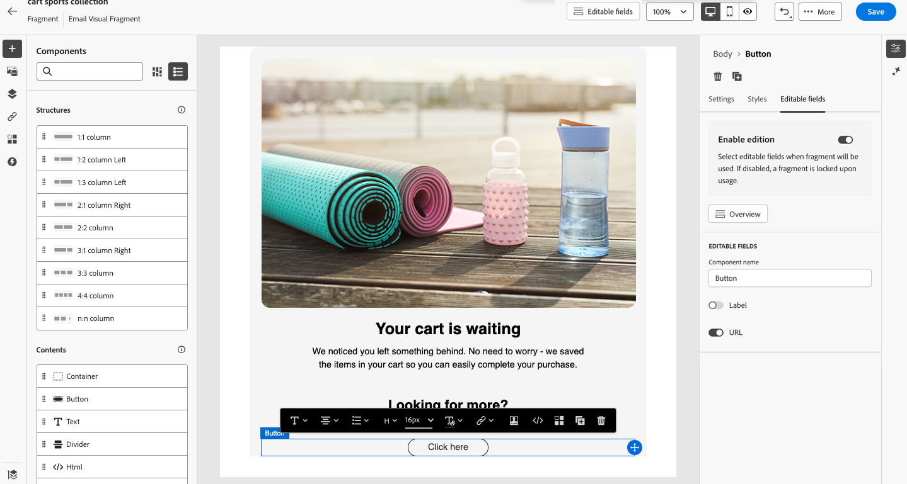

# Parametriserade fragment {#parameterized-fragments}

När fragment används i en e-postmall eller e-postmall låses de som standard på grund av arv. Det innebär att ändringar som görs i ett fragment automatiskt sprids till alla resurser där fragmentet används. Med anpassningsbara fragment kan specifika fält i ett fragment definieras som redigerbara när fragmentet läggs till i en e-post- eller e-postmall. Anta att du har ett fragment med en banderoll, text och en knapp. Du kan ange att vissa fält, t.ex. bild- eller knappens mål-URL, kan redigeras. På så sätt kan användare ändra dessa element när de infogar fragmentet i e-post-/e-postmallen, vilket ger en skräddarsydd upplevelse utan att det ursprungliga fragmentet påverkas.

Genom att utnyttja parametriserade fragment kan ni effektivt hantera och personalisera ert innehåll utan att skapa helt nya innehållsblock eller störa arvet från det ursprungliga fragmentet. Detta garanterar att ändringar som görs på fragmentnivån fortfarande sprids, samtidigt som nödvändiga anpassningar kan göras på e-post-/e-postmallnivå.

Både visuella fragment och uttrycksfragment kan markeras som anpassningsbara. Detaljerade instruktioner om hur du fortsätter med varje fragmenttyp finns i avsnitten nedan.

SCREENSHOT - GIF?

—STOPPAD REDIGERING HÄR—

## Lägga till redigerbara fält i visuella fragment {#visual}

Gör så här för att göra delar av ett visuellt fragment redigerbara:

>[!NOTE]
>
>Redigerbara fält kan läggas till i komponenterna **image**, **text** och **button**. För **HTML**-komponenter läggs redigerbara fält till med anpassningsredigeraren, ungefär som uttrycksfragment. [Lär dig hur du lägger till redigerbara fält i HTML-komponenter och uttrycksfragment](#expression)

1. Öppna skärmen för fragmentinnehållsutgåva.

1. Markera den komponent i fragmentet där du vill konfigurera redigerbara fält.

1. Panelen Komponentegenskaper öppnas till höger. Markera fliken **Redigerbara fält** och växla sedan till alternativet **Aktivera utgåva**.

1. Alla fält som kan redigeras för den valda komponenten visas i rutan. Vilka fält som är tillgängliga för redigering beror på den valda komponenttypen.

   I exemplet nedan tillåter vi redigering av URL:en för knappen Klicka här.

   {width="800" zoomable="yes"}

1. Klicka på **Översikt** om du vill kontrollera alla redigerbara fält och deras standardvärden.

   I det här exemplet visas knappens URL-fält med det standardvärde som definierats i komponenten. Det här värdet kan anpassas av användare efter att de har lagt till fragmentet i innehållet.

   {width="800" zoomable="yes"}

1. När du är klar sparar du ändringarna för att uppdatera fragmentet.

1. När du har lagt till fragmentet i ett e-postmeddelande kan användarna anpassa alla redigerbara fält som är konfigurerade i fragmentet.

## Lägga till redigerbara fält i HTML-komponenter och uttrycksfragment {#expression}

Om du vill göra delar av en HTML-komponent eller ett uttrycksfragment redigerbara måste du använda en specifik syntax i uttrycksredigeraren. Detta innebär att deklarera en **variabel** med ett standardvärde som användare kan åsidosätta efter att ha lagt till fragmentet i innehållet.

Anta till exempel att du vill skapa ett fragment som ska läggas till i dina e-postmeddelanden, och tillåta användare att anpassa en viss färg som används på olika platser, till exempel ramar eller knappars bakgrundsfärger. När du skapar fragmentet måste du deklarera en variabel med ett **unikt ID**, till exempel &quot;color&quot;, och anropa den på de önskade platserna i fragmentinnehållet där du vill använda den här färgen. När du lägger till fragmentet i innehållet kan användarna anpassa färgen som används där variabeln refereras.

För HTML-komponenter kan bara specifika element bli redigerbara fält. Expandera avsnittet nedan om du vill ha mer information.

+++Redigerbara element i HTML-komponenter:

Elementen nedan kan bli redigerbara fält i en HTML-komponent:

* En del av text
* En fullständig URL för länk eller bild (fungerar inte med delar av en URL)
* Hela CSS-egenskapen (fungerar inte med partiell egenskap)

I koden nedan kan till exempel varje element som är markerat med rött bli en egenskap:

{width="500" zoomable="yes"}

+++
