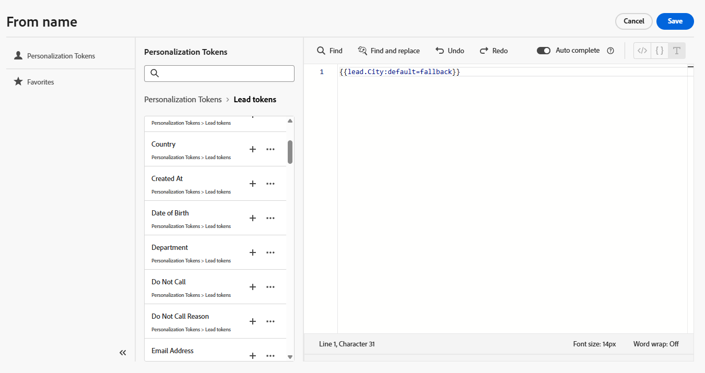

# Personalization Tokens {#personalization-tokens}

E-postens Designer har ett annat format än den klassiska e-postredigeraren när det gäller e-postpersonaliseringstoken. Ändringen implementerades för att förbättra kompatibiliteten med Handlebar-skript och effektivisera skapandet av e-postmeddelanden.

>[!AVAILABILITY]
>
>Från och med 23 maj 2025 kommer den här funktionen att distribueras till Marketo Engage-användare i grupper, med en region uppdaterad per vecka. Under utrullningen kommer e-postmeddelanden som skapas med den nya e-postdesignern automatiskt att migrera befintliga tokens till det nya formatet. Med den här uppdateringen kommer alla tokens endast att vara tillgängliga på engelska.

## Primär användning {#primary-use-case}

Den här förbättringen är främst till nytta för övergången från [hastighetsskript](https://experienceleague.adobe.com/en/docs/marketo-developer/marketo/email-scripting){target="_blank"} till Handlebar-skript. Den nya e-postadressen Designer har bara stöd för det nya tokenformatet. Det uppdaterade formatet eliminerar blanksteg och lägger till en reviderad standardtextstruktur, vilket ger en smidigare och effektivare skriptupplevelse.

## Tokenupplevelse {#token-experience}

En titt på tokenupplevelsen, både gammal och ny.

### Gammalt format {#old-format}

I den klassiska e-postredigeraren kan du lägga till variabler med mellanslag, till exempel `lead.Anonymous IP` eller `member.registration code`. Standardtextens format var: `{{lead.City:default=fallback}}`

{width="500" zoomable="yes"}

### Nytt format {#new-format}

I e-postdesignern måste du anpassa dig till [kamerans skiftläge](https://developer.mozilla.org/en-US/docs/Glossary/Camel_case) eller understreck för tokens (t.ex. `lead.anonymousIP` eller `member.registration_code`). Formatet för standardtexten ändras också till ``.

{width="600" zoomable="yes"}

## Saker att notera {#things-to-note}

* Anpassningsredigeraren har även följande funktioner som underlättar redigeringen:

   * Ångra/gör om
   * Sök/Sök och ersätt
   * Komplettera automatiskt

* **Alla**-token som tidigare hade stöd i Marketo Engage stöds i den nya personaliseringsredigeraren.
