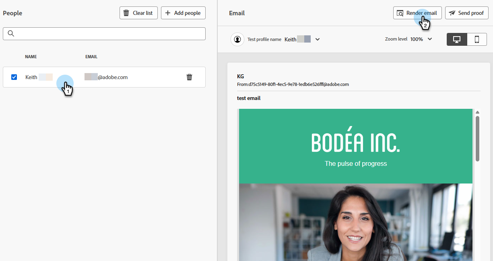

# Testa e-poståtergivning med Litmus {#test-email-rendering-with-litmus}

Utnyttja ditt [Litmus](https://www.litmus.com/email-testing)-konto i Marketo Engage för att omedelbart se hur din e-post återges i vanliga e-postklienter.

>[!AVAILABILITY]
>
>Den här funktionen är tillgänglig för alla Marketo Engage-användare som har ett aktivt [Litmus Enterprise](https://www.litmus.com/enterprise){target="_blank"}-konto.

## Så här använder du {#how-to-use}

1. På skärmen _Redigera e-postinnehåll_ klickar du på knappen **Simulera innehåll** .

   

1. Välj testmottagare och klicka på knappen **Återge e-post** .

   {width="800" zoomable="yes"}

1. Om du inte redan har det **ansluter du ditt Litmus-konto**. Om du redan har gjort det går du vidare till steg 6.

   {width="800" zoomable="yes"}

1. Ange dina inloggningsuppgifter och klicka på **Logga in**.

   >[!IMPORTANT]
   >
   >När du ansluter ditt Litmus-konto till Marketo Engage godkänner du att testmeddelanden skickas till Litmus. När du har skickat testmeddelandena hanteras dessa inte längre av Adobe. Litmus-principen för datalagring gäller därför för dessa e-postmeddelanden, inklusive personaliseringsdata som kan inkluderas i dem.

1. Klicka på **Anslut** för att slutföra integreringen.

   

1. Klicka på knappen **Kör test** om du vill generera förhandsgranskningar via e-post.

1. Se hur materialet ser ut i vanliga e-postklienter för datorer, mobiler och webben. Klicka på så många miniatyrbilder du vill förhandsgranska.

   {width="800" zoomable="yes"}

   >[!NOTE]
   >
   >Lär dig hur du [anpassar din standardlista för e-postklienter](https://help.litmus.com/article/227-change-your-default-email-clients-list).

1. När du har testat klart klickar du på bakåtpilen uppe till vänster för att återgå till skärmen _Simulera innehåll_.

   

**VALFRITT STEG**: Om du bestämmer dig för att göra ändringar i e-postmeddelandet måste du klicka på **Återge e-post** för att visa dem. Se även till att klicka på knappen **Testa igen** längst upp till höger på skärmen _Förhandsvisa e-post_.

