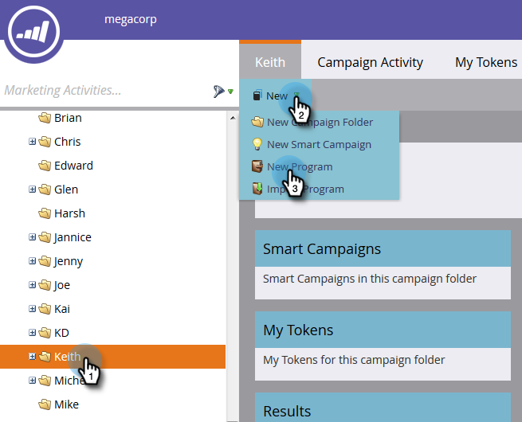

# Skapa ett e-postprogram {#create-an-email-program}

Använd e-postprogram för att snabbt och enkelt skicka ett e-postmeddelande till en grupp personer.

1. Gå till **Marknadsföringsaktiviteter**.

   

1. Markera mappen som du vill skapa programmet i, klicka på listrutan **Nytt** och välj **Nytt program**.

   

1. Ange ett namn, välj **E-post** som programtyp och klicka på **Skapa**.

   

   >[!NOTE]
   >
   >När du väljer **E-post** som programtyp ställs kanalen automatiskt in på **Skicka e-post**. Du kan ändra den om du vill.

   

Snyggt! Lägg märke till att programmet nu finns i trädet och är klart att användas. Nästa steg blir att definiera er målgrupp. Se Marketo Related Articles nedan.

>[!MORELIKETHIS]
>
>* [Definiera en publik med en smart lista](/help/marketo/product-docs/email-marketing/email-programs/managing-people-in-email-programs/define-an-audience-with-a-smart-list.md)
>* [Definiera en publik genom att importera en lista](/help/marketo/product-docs/email-marketing/email-programs/managing-people-in-email-programs/define-an-audience-by-importing-a-list.md)

