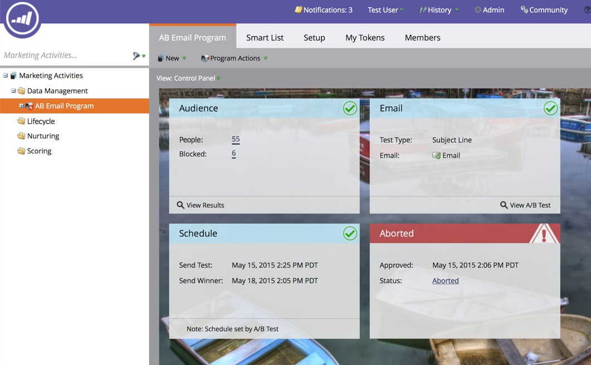

# Avbryt e-postprogram {#abort-email-program}

Oj då! Bromsa! Det här e-postprogrammet bör inte gå ut.

>[!NOTE]
>
>Den här artikeln är avsedd att hjälpa dig att förhindra att e-postmeddelanden skickas innan de skickas. Det finns inget sätt att återkalla skickade e-postmeddelanden.

1. Klicka på **[!UICONTROL Abort Program]** i ett e-postprogram.

   

1. Klicka på **[!UICONTROL Abort]** om du vill ha fullständig bekräftelse.

   

1. En meddelanderubrik visas som anger att det här e-postprogrammet har avbrutits.

   

   >[!CAUTION]
   >
   >När e-postprogrammet har avbrutits kan det inte schemaläggas om.

Vis! Är du inte glad att du kan undvika de där dyra felen?
